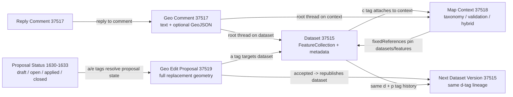
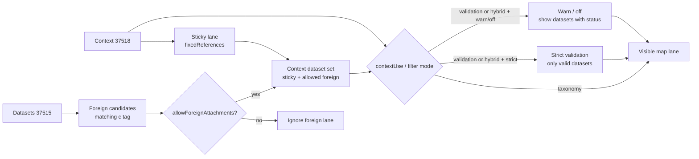
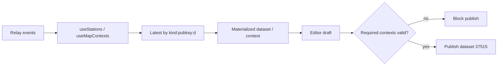
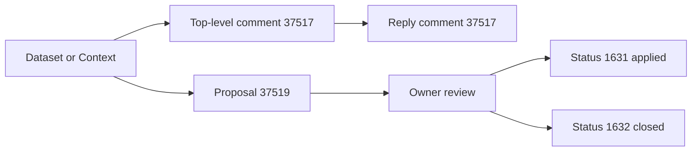
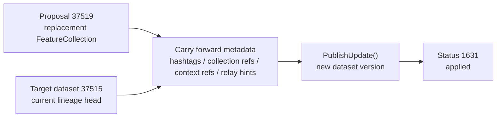

# 🌍 Earthly

Earthly is a Nostr-native collaborative mapping application for creating, publishing, and exploring GeoJSON datasets over a decentralized relay network. It combines a mobile-friendly map editor, blossom-hosted PMTiles basemaps, and social features like comments and reactions on top of geographic data.

## ✨ Features

- 🧵 Nostr-native geo entities: datasets, map contexts, comments, and edit proposals (kinds 37515, 37518, 37517, 37519)
- 🌸 Blossom-hosted PMTiles basemaps and overlay layers, announced via Nostr
- 🧩 Chunked Protomaps basemap: 120GB+ global tiles split into geohash-based PMTiles chunks
- 🗺️ MapLibre GL editor with touch-first drawing tools (points, lines, polygons, multi-geometries)
- 🔍 Precise mobile drawing: pan-lock, long-press point creation, magnifier lens
- 🛠️ Geometry editing: move, rotate, merge/split multi-geometries with gizmos
- 🚀 Dataset publishing, versioning, and loading workflow backed by Nostr events
- 💬 GeoJSON-aware comments and annotations on datasets and contexts

## 🧰 Tech Stack

- ⚡ Runtime: Bun (not Node.js)
- 🧩 Frontend: React 19 + TypeScript
- 🧱 Backend: Bun.serve() HTTP server
- 🛰️ Relay: Go (Khatru-based Nostr relay)
- 🗺️ Mapping: MapLibre GL + Protomaps PMTiles basemaps
- 🧠 State: Zustand
- 🔑 Nostr: Nostr Dev Kit (NDK + @nostr-dev-kit/react)
- 🎨 Styling: Tailwind CSS v4 + Radix UI components

See [CLAUDE.md](./CLAUDE.md) and [SPEC.md](./SPEC.md) for a deeper overview of the editor and event formats.

## 🗂️ Project Structure

High-level layout:

```text
src/
  components/          Shared UI and panels
  features/
    geo-editor/        Map editor feature (core engine + UI)
  config/              Environment and platform config
  lib/                 Shared libraries (Nostr, geo, hooks)
  ctxcn/               ContextVM / MCP client
  index.ts             Bun web server and map-layer announcer
  blossom.ts           Blossom blob server (PMTiles + blobs)

map-scripts/           PMTiles chunking and layer tools
relay/                 Go Khatru relay
docs/                  Operational docs (Blossom, chunking)
contextvm/             ContextVM server configuration
data/                  Example GeoJSON datasets
styles/                Global CSS
ARCHITECTURE_ANALYSIS.md  Generated architecture overview
SPEC.md                   Nostr GeoJSON event specification
```

Key modules:

- 🧩 Frontend entry: [frontend.tsx](src/frontend.tsx) and [App.tsx](src/App.tsx)
- 🌐 Bun server and map announcement publisher: [index.ts](src/index.ts)
- 🌸 Blossom blob server (BUD-01): [blossom.ts](src/blossom.ts)
- Geo editor feature:
  - Core engine and managers: [GeoEditor.ts](src/features/geo-editor/core/GeoEditor.ts) and managers under `core/managers/`
  - Editor orchestration: [GeoEditorView.tsx](src/features/geo-editor/GeoEditorView.tsx)
  - Zustand store: [store.ts](src/features/geo-editor/store.ts)
  - Map component and PMTiles integration: [Map.tsx](src/features/geo-editor/components/Map.tsx)
- Nostr event wrappers:
  - GeoJSON datasets: [NDKGeoEvent.ts](src/lib/ndk/NDKGeoEvent.ts)
  - Map contexts: [NDKMapContextEvent.ts](src/lib/ndk/NDKMapContextEvent.ts)
  - Geo edit proposals: [NDKGeoEditProposalEvent.ts](src/lib/ndk/NDKGeoEditProposalEvent.ts)
  - Map layer set announcement: [NDKMapLayerSetEvent.ts](src/lib/ndk/NDKMapLayerSetEvent.ts)
  - Geo comments: [NDKGeoCommentEvent.ts](src/lib/ndk/NDKGeoCommentEvent.ts)
- 🧰 PMTiles chunking tools and announcements: [map-scripts/index.ts](map-scripts/index.ts)

For a detailed, generated breakdown of components, sizes, and diagrams, see [ARCHITECTURE_ANALYSIS.md](./ARCHITECTURE_ANALYSIS.md).

## 🌸 Blossom-Hosted PMTiles and Map Announcements

Earthly uses Protomaps PMTiles to serve global basemaps and raster/vector overlays as single files, accessed via HTTP range requests instead of traditional `{z}/{x}/{y}` tile servers.

Because a full global PMTiles archive can exceed 120GB, the project includes a chunking system:

- 🧩 The `map-scripts` tool splits a source PMTiles basemap into geohash-based chunks (e.g. `g`, `u`, `v`, ...) and writes them to `map-chunks/` with SHA-256 filenames.
- 📣 For each geohash, an `announcement.json` entry maps:

  ```json
  "g": {
    "bbox": [-45, 45, 0, 90],
    "file": "0239b11d1d780978d8ccb203907c38cf803b46ace4ea64893d4f0eff3b522bd0.pmtiles",
    "maxZoom": 16
  }
  ```

- 🚚 These files are served by the dedicated Blossom server (`src/blossom.ts`), which supports range requests and multiple blob types.
- 🧵 On startup, the Bun server (`src/index.ts`) reads:
  - `map-chunks/announcement.json` (chunked-vector basemap)
  - Any `*.announcement.json` PMTiles overlay descriptors
  and publishes a Nostr kind `15000` “map layer set” event signed by the server key.
- 🧭 The React map component (`src/features/geo-editor/components/Map.tsx`) subscribes to these kind `15000` announcements, selects the latest, and:
  - Configures a `pmworld://` protocol that looks up the current map center’s geohash and routes tile requests to the appropriate Blossom-hosted PMTiles chunk.
  - Builds a MapLibre style with a chunked-vector Protomaps basemap and optional raster overlay layers.

This architecture yields distributed, “unruggable” maps: as long as PMTiles blobs remain on Blossom-compatible storage, clients can discover and render them via Nostr announcements without relying on a single HTTP tile server.

## ✍️ Geo Editor and Mobile Drawing

The geo editor is designed to work well on both desktop and mobile:

- 📍 Draw points, lines, polygons, and multi-geometries
- 🧰 Transform geometry with move/rotate gizmos
- 🧩 Merge and split multi-geometries
- 🔒 Lock panning on mobile to improve touch accuracy
- ⏱️ Create points via long-press with a preview before releasing
- 🔎 Optional magnifier lens for pixel-precise placement
- 🪟 All edits are reflected live in the side panels (properties, metadata, blob references)

Editor orchestration lives in `src/features/geo-editor/GeoEditorView.tsx`, with core logic encapsulated in the `GeoEditor` class and its managers.

## 🤝 Entity Architecture

Earthly's active Nostr model is centered on four geo entities: dataset (`37515`), map context (`37518`), geo comment (`37517`), and geo edit proposal (`37519`).

The key idea is simple:

- datasets carry publishable geometry,
- contexts shape how datasets are grouped and validated,
- comments add threaded discussion,
- proposals suggest replacement geometry for a dataset lineage.



Current-model note:

- Kind `37516` collections are deprecated in the active app model and have been superseded by map contexts.
- Some legacy `collection` tags still exist for compatibility, but the runtime model is dataset + context, not dataset + collection.

### Context View Model

Contexts do not own foreign geometry directly. They assemble a view from two lanes:

- Sticky lane: datasets or features pinned by the context author via `fixedReferences`.
- Foreign lane: datasets that self-attach via `["c", "<kind>:<pubkey>:<d>"]`.



## 🔄 Runtime Flows

### Materialization And Publish Gate

Datasets and contexts are treated as parameterized replaceable lineages in the UI by collapsing relay results to the latest `kind:pubkey:d` coordinate.



### Social Layer

Comments add threaded discussion to datasets or contexts. Proposals add reviewable replacement geometry to datasets.



### Proposal Acceptance

Accepting a proposal does not mutate the proposal event. It creates a new dataset version in the target lineage and then records proposal status.



## 🔧 Environment and Configuration

Environment variables are validated via `src/config/env.schema.ts` and exposed to:

- Backend: `src/config/env.server.ts`
- Frontend: `src/config/env.client.ts`

Key variables:

- `RELAY_URL` – primary Nostr relay WebSocket URL
- `SERVER_KEY` – server private key (used to sign map announcements)
- `SERVER_PUBKEY` – public key for the ContextVM geo server
- `CLIENT_KEY` – client private key for ContextVM communication
- `APP_PRIVATE_KEY` – app private key for backend signing (optional)
- `BLOSSOM_SERVER` – base URL for Blossom map chunks (default: `https://blossom.earthly.city`)
- `NODE_ENV` – `development` | `production` | `test`

## 📦 Installation

Install dependencies:

```bash
bun install
```

## ▶️ Running the App

Development workflow:

```bash
# Start Bun dev server with HMR
bun dev

# Start Go relay on port 3334
bun relay

# Optional: start Blossom server for local PMTiles
bun run blossom
```

Production workflow:

```bash
# Build frontend bundle
bun run build
# or
bun run build:production

# Start production server (serves dist/ and publishes layer announcements)
bun start
```

Map chunking and PMTiles layers:

```bash
# Chunk a large PMTiles basemap into geohash-based chunks
bun run chunk            # default precision=1, maxZoom=8

# Custom chunking (e.g. higher zooms)
bun run chunk 2 10

# Add a custom PMTiles layer (raster or vector) as an overlay
bun run add-layer
```

For detailed VPS and Blossom setup, see:

- [docs/VPS_CHUNKING.md](docs/VPS_CHUNKING.md)
- [docs/BLOSSOM_SERVER.md](docs/BLOSSOM_SERVER.md)

## 🧪 Testing and Linting

Lint the codebase with Biome:

```bash
bun run lint
```

Auto-fix lint issues:

```bash
bun run lint:fix
```

Tests are run via Bun’s built-in test runner (see `bun test` or individual test files such as `map-scripts/geohashWorld.test.ts`).

## 📚 Further Reading

- Editor internals and refactoring notes: [GEO_EDITOR_README.md](GEO_EDITOR_README.md)
- Generated architecture diagrams and component inventory: [ARCHITECTURE_ANALYSIS.md](ARCHITECTURE_ANALYSIS.md)
- Nostr GeoJSON event spec: [SPEC.md](SPEC.md)
- Geo entity relationships and graph prompts: [docs/NOSTR_GEO_ENTITIES_ARCHITECTURE.md](docs/NOSTR_GEO_ENTITIES_ARCHITECTURE.md)
- Map context explainer and context-specific graph prompts: [docs/MAP_CONTEXT_SIMPLE_EXPLAINER.md](docs/MAP_CONTEXT_SIMPLE_EXPLAINER.md)
