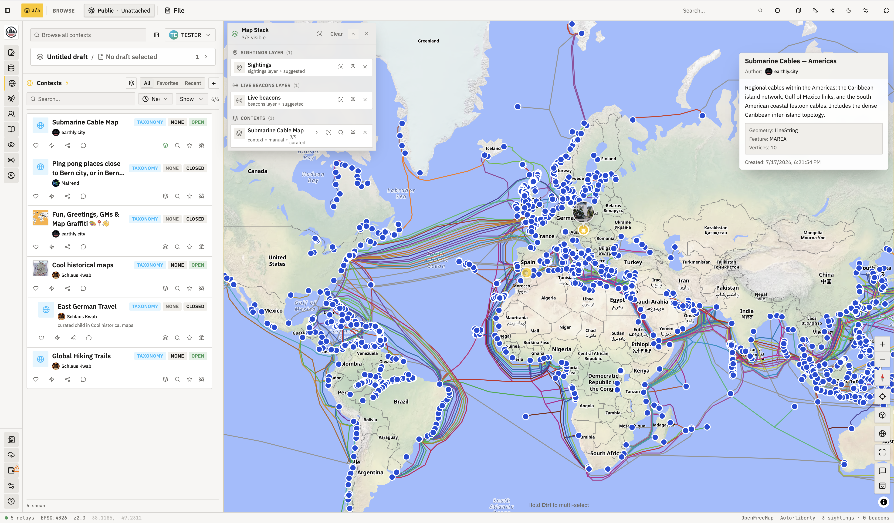
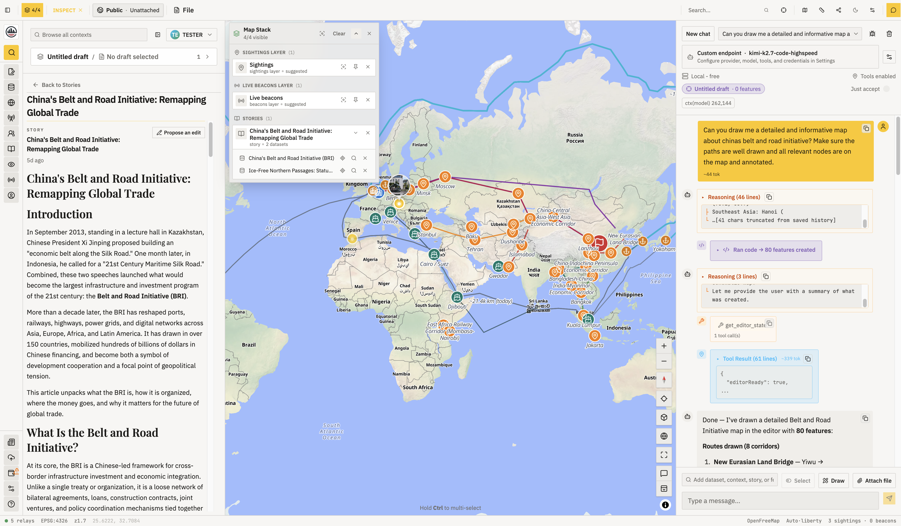
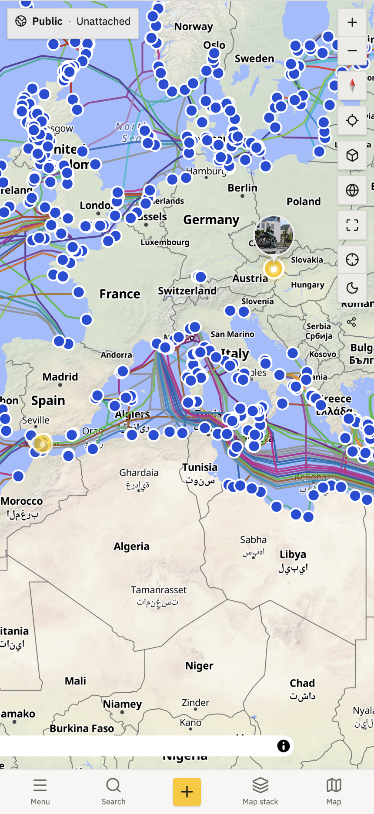
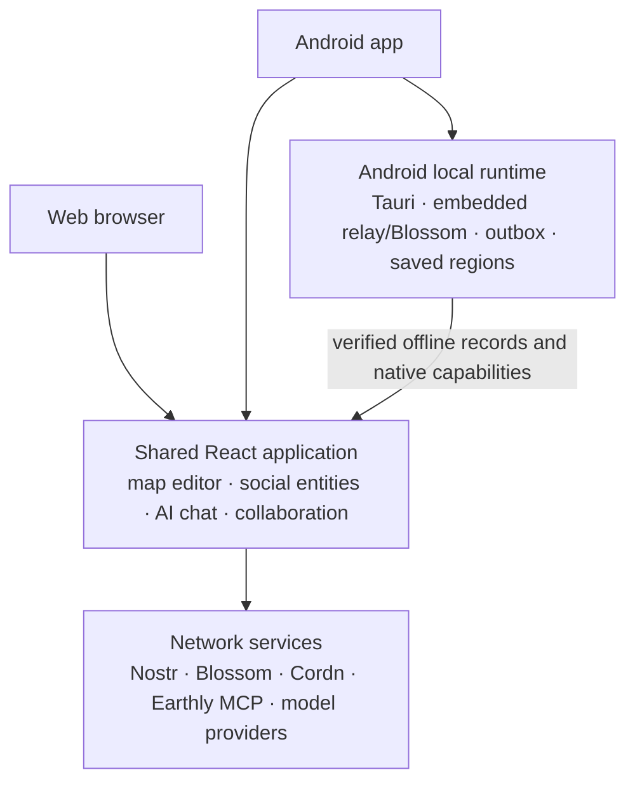

<h1 align="center">
  
</h1>

Earthly is a collaborative map editor built on Nostr that helps people turn local knowledge into useful, shared maps. Draw and publish geographic datasets, bring them together in groups, discuss places with geometry-aware comments, share live observations, and collaborate privately or nearby—even when the internet is unreliable.

The same React application runs on the web and in the Android app. The Android build adds a local Nostr relay and Blossom server, device pairing, saved regions, durable delivery, deep links, and offline field collaboration through a reusable Rust node.

<p align="center">
  <a href="https://earthly.city">Open Earthly</a> ·
  <a href="docs/architecture/overview.md">Architecture</a> ·
  <a href="SPEC.md">Entity specification</a> ·
  <a href="docs/TAURI-DEVELOPMENT.md">Android development</a>
</p>

<p align="center">
  <a href="docs/image_web.png">
    
  </a>
  <br>
  <sub>Explore shared geographic knowledge, compose layers, and inspect rich map entities. Click to view full size.</sub>
</p>

## What Earthly supports

- 🗺️ Touch-first GeoJSON drawing and editing for points, lines, polygons, and multi-geometries.
- Public, versioned geographic entities published to Nostr relays.
- Groups/topics that curate or accept attached datasets and other geo entities.
- 💬 Geometry-aware comments, replies, edit proposals, stories, sightings, and live beacons.
- Images and large/content-addressed files stored on Blossom-compatible servers.
- PMTiles basemaps and overlays discovered through trusted Nostr announcements.
- 🔒 MLS-encrypted private groups with invitations, roles, chat, comments, and shared geometry.
- 🥾 Nearby field sessions where paired Earthly phones can publish, sync, and mirror blobs on a local network.
- 📲 Native saved regions and a durable publish outbox for Android.
- ✨ AI-assisted mapping with typed editor tools, remote ContextVM/MCP tools, guarded bulk edits, file ingest, and a QuickJS geospatial sandbox.
- Responsive desktop and mobile navigation with one visible authoring destination.

## From research desk to fieldwork

### Build rich maps with an AI collaborator

Earthly's mapping assistant works inside the editor: it can reason over the current map, use typed tools, create geometry, and help turn geographic research into structured, reviewable work.

<p align="center">
  <a href="docs/image_wb_chat.png">
    
  </a>
  <br>
  <sub>A story, its datasets, the live map, and the tool-using assistant remain visible together. Click to view full size.</sub>
</p>

### Carry the same map into the field

<p align="center">
  
  <br>
  <strong>The full Earthly workspace, shaped for touch.</strong>
</p>

<p align="center">
  <a href="docs/image_mobile.png">
    
  </a>
  <br>
  <sub>Browse, draw, inspect layers, and collaborate from the Android app—even across a nearby field network.</sub>
</p>

## Architecture at a glance



[Open the detailed system context](docs/architecture/diagrams/system-context.svg).

Earthly has four important architectural boundaries:

1. The geo editor owns geometry interaction, while publishing owns the destination.
2. The Nostr runtime owns the shared EventStore, relay pool, accounts, cache, and public publish path.
3. Platform contracts keep browser and Tauri capabilities behind validated adapters.
4. Private MLS groups and nearby field sessions share map/editor projection, but retain different delivery and trust models.

Read the canonical architecture set for module ownership, data flow, invariants, refactoring pressure points, and test surfaces:

- [System overview](docs/architecture/overview.md)
- [Editor and publishing](docs/architecture/editor.md)
- [AI chat and tool execution](docs/architecture/chat.md)
- [Native application and offline system](docs/architecture/native-and-offline.md)
- [MLS private collaboration](docs/architecture/private-collaboration.md)

## Technology

| Area | Implementation |
| --- | --- |
| Web/runtime | Bun, React 19, TypeScript |
| UI/state | Tailwind CSS 4, Radix/Base UI, Zustand |
| Mapping | MapLibre GL, PMTiles, Turf, GeoJSON |
| Nostr | Applesauce accounts/actions/core/loaders/relay/signers, `nostr-idb`, `nostr-tools` |
| Private collaboration | `ts-mls`, Cordn-compatible ContextVM coordinator |
| AI chat and research | OpenAI-compatible streaming, ContextVM/MCP, self-hosted SearXNG, Wikipedia/Wikidata, QuickJS/WASM workers |
| Native app | Tauri 2, Rust, Android |
| Local/offline node | Embedded Nostr relay, embedded Blossom, signed pairing and scoped peer policy |
| Public relay | Go, Khatru, LMDB, Bleve geo/search index |
| Validation/testing | Zod, Bun test, Playwright, Android UI Automator, Rust tests |

## Repository map

```text
src/
  components/               Shared application UI
  features/
    geo-editor/              Editor engine, map shell, publishing, workspaces
    chat/                    AI conversation runtime, tools, safety, workers
    private-maps/            Private-group React integration
    field-sessions/          Nearby collaboration UI and transport hydration
    offline/                 Pairing, saved-region, and diagnostics surfaces
    social/                  Public entity/social feature UI
  lib/
    nostr/                   EventStore, relay/accounts/cache/publish and entities
    private-workspace/       MLS state, policy, service, runtime, projection
  platform/                  Browser/Tauri capability contracts and adapters
  index.ts                   Bun HTTP/SPA/OG/NIP-05 server
  frontend.tsx               React entry point

src-tauri/                   Tauri shell and native command implementations
crates/earthly-local-node/   Reusable Rust local node
crates/nostr-relay-builder/  Embedded relay builder fork/patches
relay/                       Public Go relay and geo search index
contextvm/                   Earthly geo/web MCP server over Nostr
ai-suite/                    Browser tasks and Playwright scenarios
android-suite/               Deterministic Android emulator tests
docs/                        Architecture, native, deployment, and operations docs
```

## Getting started

### Prerequisites

For web development:

- [Bun](https://bun.sh/) 1.3 or newer;
- Go for the local relay;
- Docker for the pinned Cordn development coordinator, or Corepack/pnpm for the source fallback.

For Android development, also install Rust, Android Studio/SDK/NDK, platform tools, and the required Rust Android targets. Run `bunx tauri info` to inspect the local toolchain.

### Install

```sh
bun install --frozen-lockfile
```

### Run the browser development stack

```sh
bun run dev
```

This command starts the local Go relay on `ws://localhost:3334`, resets and seeds it, starts the ContextVM server, starts a pinned Cordn-compatible coordinator, and runs the Bun/React development server at `http://localhost:3000`.

> `bun run dev` intentionally resets the local development relay. Do not point this workflow at a public relay or use it for durable local data.

The local script does not launch a Blossom server. Network image/file operations use the configured Blossom URL; production-safe defaults are applied outside a loopback browser origin.

Useful focused commands:

```sh
bun run relay              # local Go relay only
bun run cordn:dev           # local Cordn coordinator only
bun run tauri:frontend      # frontend only, used by Tauri
bun run seed:entities       # seed current entity model
bun run seed:sightings      # seed temporal sightings
```

## Build and run

```sh
bun run build               # build the web bundle into dist/
bun run build:production    # validate/load production env, then build
bun run start               # serve a production bundle with Bun
```

Production configuration is documented by [`.env.production.example`](.env.production.example). Private keys remain server-side; only the allowlisted values in [`src/config/env.schema.ts`](src/config/env.schema.ts) are injected into the frontend bundle.

The ContextVM research tools use a private, loopback-only SearXNG service and degrade to Wikipedia/Wikidata when a provider is unavailable. See the [SearXNG operations guide](docs/operations/searxng.md) for the one-time VPS setup and routine health checks.

Important public configuration:

| Variable | Purpose |
| --- | --- |
| `RELAY_URL` | Comma-separated primary Nostr relay URLs |
| `EXTRA_READ_RELAYS` | Optional read-only relay extensions |
| `BLOSSOM_SERVER` | Default Blossom base URL |
| `SERVER_PUBKEY` | Earthly ContextVM server identity |
| `CORDN_SERVER_PUBKEY` | Cordn-compatible private-group coordinator identity |
| `MAPNOLIA_TRUSTED_PUBKEYS` | Trusted kind-34444 map-layer announcers |

Local loopback development isolates writes from public relays even when broader read relays are configured. See [relay stages](docs/RELAY_STAGES.md).

## Android development

Install a development build on every authorized USB or Wi-Fi ADB device:

```sh
bun run tauri:android:install:dev
```

Build a debug APK directly:

```sh
bun run tauri:android:init
bun run tauri:android:build --debug --target aarch64
```

Use `x86_64` for the standard emulator target. The supported release target is Android; desktop Tauri builds are useful for development, while iOS, Windows, Linux, and macOS distribution are currently deferred.

See [Tauri development](docs/TAURI-DEVELOPMENT.md) for toolchain setup, pairing, local-node behavior, Android lifecycle rules, and current status.

## Tests and checks

```sh
bun run test                # TypeScript/Bun tests
bun run lint                # Biome checks
cargo test --workspace      # native/local-node tests
cd relay && go test ./...   # relay and search tests
```

Browser journeys and audits run against an already-running loopback server:

```sh
bun run ai:list
bun run ai:typecheck
bun run ai:e2e
bun run ai:audit
bun run ai:verify
```

Android-only integration runs on an emulator by default:

```sh
bun run e2e:android:list
bun run e2e:android:emulator
bun run e2e:android:smoke
```

Read [`ai-suite/README.md`](ai-suite/README.md) before adding browser automation and [`android-suite/README.md`](android-suite/README.md) before adding emulator scenarios.

## Nostr entity model

The active application model is documented in [`SPEC.md`](SPEC.md). Its primary kinds are:

| Kind | Entity |
| ---: | --- |
| `37515` | GeoJSON dataset |
| `37517` | Geo comment |
| `37518` | Group/topic |
| `37519` | Geo edit proposal |
| `37520` | Story/article |
| `37521` | Live beacon |
| `37522` | Temporal sighting |
| `34444` | Trusted map-layer-set announcement |

Kind `37516` collections are not part of the active UI model. New-model groups, stories, beacons, and sightings carry an explicit model-version discriminator; legacy/malformed records are skipped rather than partially rendered.

## Diagrams

Architecture diagrams are stored as D2 source plus generated SVG. Regenerate them with:

```sh
bun run docs:diagrams
```

The command downloads the pinned D2 v0.7.1 binary from the [official release](https://github.com/terrastruct/d2/releases/tag/v0.7.1), verifies its SHA-256 checksum, and caches it under `.cache/tools` when D2 is not already installed. Set `D2_BIN=/path/to/d2` to use an existing pinned binary. The SVGs are committed so normal readers and GitHub do not require a diagram tool.

## Operations and releases

- [VPS operations](docs/VPS_OPS.md)
- [Private maps deployment](docs/PRIVATE-MAPS-DEPLOYMENT.md)
- [Android release](docs/ANDROID-RELEASE.md)
- [Android update and release](docs/ANDROID-UPDATE-RELEASE.md)

## License

[MIT](LICENSE.md)
