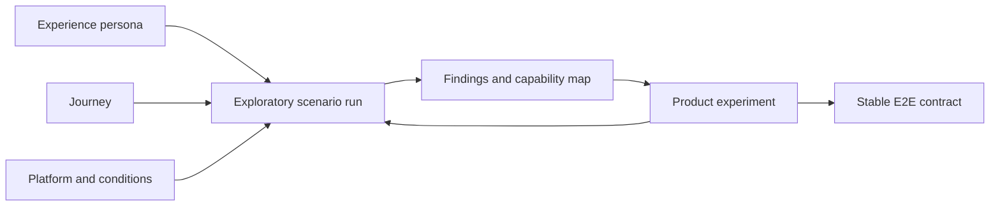

# Earthly Journey Lab plan

Status: implementation started; first mobile vertical slice audited
Date: 2026-07-18

Current implementation evidence lives in
`ai-suite/experience-lab/findings/squirrel-capture-baseline.md`. Phases 1 and 2 are operational; the
Phase 3 deterministic replay, first bounded experiment, and promoted editor contract are complete.
Media, human observation, and the remaining Phase 3 experiments are intentionally still open.

## Purpose

The **Earthly Journey Lab** is a persona-guided, evidence-backed product-development loop. It uses
exploratory AI role-play, human session cards, reusable browser tasks, deterministic E2E contracts,
and cross-journey synthesis to improve Earthly without turning every specialist need into another
global control.

Earthly must support both quick, low-patience capture and sophisticated professional mapping. The
goal is not to make one screen resemble both Snapchat and Blender. The product principle is:

> Many simple doors into one powerful house.

Explore, Capture, Coordinate, Build, and Analyze are **intent lanes**, not separate applications or
sticky modes. They reveal complexity when a journey needs it while sharing the same underlying
entities and capabilities.

## Outcomes

The Journey Lab should let the team:

- preserve experience personas and journeys as durable, reviewable repository artifacts;
- run the same journey through exploratory AI role-play, stakeholder review, and human testing;
- turn stable, important behavior into reusable Playwright or Android contracts;
- compare before-and-after experience evidence without relying on brittle pixel assertions;
- find cross-cutting capabilities before introducing persona-specific UI or navigation;
- measure exit, recovery, continuation, privacy understanding, and platform parity—not only the
  happy-path completion;
- discover genuinely useful features while keeping a visible complexity budget.

## Non-goals

- AI personas do not replace real users or domain experts.
- A simulated finding is not automatically a requirement or a feature request.
- Not every exploratory journey becomes a permanent E2E test.
- The browser suite does not pretend to verify Android WebView, intent, permission, or process
  lifecycle behavior.
- The first implementation will not build a general-purpose LLM evaluation platform.
- Experience personas will not contain secrets or become alternate signer fixtures.

## Operating model



Every cycle has two deliberately different passes:

1. **Exploration pass** — the persona receives its behavioral card and the visible application, but
   not selector recipes or implementation knowledge. This preserves discoverability evidence.
2. **Replay pass** — reusable Earthly tasks reproduce the chosen path deterministically and record
   observable postconditions, screenshots, browser health, and structured measurements.

Subjective statements such as “this is confusing” belong in findings. Stable claims such as “a
cancelled mobile drawing unlocks panning” belong in E2E contracts.

## Canonical artifacts

| Artifact | Purpose | Durable? |
| --- | --- | --- |
| Test identity | Supplies a deterministic account and signer | Yes; local-only credentials |
| Experience persona | Defines goals, sophistication, patience, constraints, and abort behavior | Yes |
| Journey | Defines the job, actors, entry state, recovery, outcome, and next task | Yes |
| Scenario run | Binds persona, journey, platform, connectivity, privacy, and seeded data | Definition yes; generated evidence no |
| Review lens | Applies accessibility, privacy, product, domain, or parity scrutiny | Yes |
| Experience finding | Records observed friction and affected capabilities | Yes when triaged |
| Capability map | Shows shared product behavior across journeys | Yes |
| Product experiment | Describes a proposed change and its cross-persona impact | Yes while active |
| E2E contract | Protects critical stable behavior | Yes |
| Run evidence | Screenshots, traces, console output, and measurements | Generated and ignored |

Organizations are not personas. “Logging company” becomes at least a **forestry planner** and a
**field crew member** participating in one multi-actor journey. “Delivery company” similarly becomes
a dispatcher and a deliverer. This exposes handoff failures that a single fictional company persona
would hide.

## Repository shape

Implement the first version inside the existing AI suite so it reuses environment guards, fixtures,
tasks, reports, and localhost-only publishing rules:

```text
ai-suite/
  test-identities/          deterministic signer fixtures; replaces the overloaded personas name
  experience-lab/
    README.md               authoring and execution guide
    model.ts                typed artifact contracts and enums
    catalog.ts              personas, journeys, lenses, and coverage inventory
    personas/               one behavioral definition per persona
    journeys/               reusable single- and multi-actor journey definitions
    lenses/                 accessibility, privacy, domain, product, and parity rubrics
    session-cards/          generated human-readable instructions, ignored when generated
    findings/               reviewed findings and synthesis, not raw run output
  scenarios/journeys/       Playwright audits and promoted contracts
  tasks/                    reusable visible Earthly actions, unchanged in purpose
  artifacts/                generated run evidence, ignored
```

The current `owner`, `mara`, and `tomas` entries should move conceptually and physically from
`personas/` to `test-identities/`. Preserve a compatibility export during the migration so existing
scenarios can move without a flag day.

Persona and journey definitions should be typed TypeScript data: diffable, discoverable by agents,
validated by the compiler, and directly consumable by catalog/report scripts. Narrative findings and
human session reports remain Markdown. Do not introduce a second test runner.

## Artifact contracts

### Experience persona

Each persona records:

- stable ID, name, short job story, and evidence level;
- domain sophistication and Earthly sophistication independently;
- patience and explicit abandonment triggers;
- primary and secondary platforms;
- connectivity, privacy, trust, accessibility, and environmental constraints;
- vocabulary they understand and terms likely to confuse them;
- mistakes and recovery behavior that should be exercised;
- journeys in which they participate.

Demographic decoration is excluded unless it materially changes the journey.

### Journey

Each journey records:

- job-to-be-done and participating personas/roles;
- starting state, seeded data, platform, connectivity, and publish channel;
- primary outcome and the evidence that proves it;
- understanding checks: where did the result go and who can see it?;
- at least one cancellation, interruption, or error-recovery branch;
- a follow-up task that proves the user is not trapped in a mode, route, destination, or account;
- capabilities touched and expected desktop/mobile availability;
- automation level: exploratory, experience audit, or product contract;
- known gaps and evidence history.

### Experience finding

Each finding records:

- the exact persona, journey step, platform, and starting conditions;
- observed behavior rather than inferred motivation;
- severity: blocker, serious friction, confusion, or opportunity;
- evidence level and evidence links;
- affected capabilities and other journeys likely to share the problem;
- proposed experiment, if any, with explicit complexity cost;
- disposition: investigate, experiment, contract, defer, or reject.

## Experience rubric

Use observable evidence instead of simulated wall-clock performance. Score each category from 0–3
with a short explanation:

| Dimension | Question |
| --- | --- |
| Entry | Can the persona find a credible place to begin? |
| Completion | Can they reach the primary outcome? |
| Decisions | How many choices require unexplained product knowledge? |
| Vocabulary | Are labels meaningful in the persona's language? |
| Destination | Do they understand where the result goes and who receives it? |
| Recovery | Can they cancel, undo, retry, resume, or change course? |
| Continuation | Can they begin the stated follow-up task without stale state locking them in? |
| Return | Does work survive reload, restart, reconnect, or another device as promised? |
| Parity | Is the relevant capability available on the appropriate desktop/mobile surface? |
| Confidence | Does the visible result clearly confirm success? |

Also record navigation depth, meaningful decisions, backtracking, dead ends, unexplained terms,
runtime/network errors, mode/destination leaks, and abandonment triggers reached. Timing is optional
context, not a comparable score, because AI and instrumented browsers operate at artificial speeds.

## Complexity budget

A finding may propose a feature, but a feature is not accepted until synthesis answers:

1. Which journeys and capabilities need it?
2. Is it new behavior or another presentation of an existing capability?
3. Can it appear contextually instead of in global navigation?
4. Can an existing control, state, or concept be removed or consolidated?
5. What happens on mobile and desktop?
6. How does the user leave, cancel, or recover from it?
7. Does it reuse Earthly entities and destination semantics?
8. Does it add hidden state, another sticky mode, or another meaning for an existing word?

One hypothetical persona is insufficient evidence for a broad feature unless the finding blocks the
persona's core journey or reveals a safety/privacy failure. Prefer changes that improve shared
capabilities such as discover, capture, author, inspect, organize, attach, share, join, synchronize,
recover, resume, and transition.

## First cohort

The first cohort is three journeys and five experience personas. All begin at evidence level
**hypothetical** and are upgraded only when informed by stakeholders or observed users.

### Journey 1: capture a squirrel sighting

**Persona: casual wildlife observer**

- Mobile-first, little mapping knowledge, very low patience.
- Sees a squirrel, takes one or more photos, accepts or adjusts location, adds a short description,
  understands that the post is public, publishes it, and sees the primary image on the map/list.
- Recovery branch: deny location once, cancel a drawing/media action, or back out before publishing.
- Follow-up task: browse another sighting and then begin a second capture.
- Initial capabilities: identity recovery, Capture lane, sighting authoring, images, location,
  destination comprehension, publish confirmation, inspect, and clean exit.
- Platforms: responsive mobile contract first; Android only for camera/location/intent behavior.

### Journey 2: publish and visit an event venue map

**Personas: event organizer and event visitor**

- Organizer uses desktop to create a venue context and geometry for stages, bars, food stands, and
  meeting points, then shares an understandable route/link.
- Visitor opens the map on mobile, finds a stage and a bar, shares or recognizes a meeting point,
  and returns to ordinary map browsing afterward.
- Recovery branch: organizer edits incorrect geometry; visitor arrives through a cold deep link and
  can recover from a closed inspector.
- Follow-up task: organizer updates one venue item; visitor explores an unrelated nearby entity.
- Initial capabilities: Build, Coordinate, and Explore lanes; contexts, datasets, labels, sharing,
  routing, inspection, map stack, updates, and desktop/mobile handoff.

### Journey 3: plan and execute a forestry field survey

**Personas: forestry planner and field crew member**

- Planner prepares or imports geometry on desktop, creates a Field session, selects what is shared,
  and hands the session to the crew.
- Crew joins on Android, understands the nearby destination, works with intermittent connectivity,
  publishes an allowed observation/comment/geometry, and sees peer changes without blinking.
- Planner receives the field result and can distinguish nearby-only work from globally published
  work.
- Recovery branch: interrupted join or reconnect, cancelled drawing, host/participant role change,
  and leaving the Field session without retargeting saved work.
- Follow-up task: crew starts an unrelated public capture; planner returns to ordinary desktop
  analysis.
- Initial capabilities: Build, Coordinate, and Capture lanes; import/draw, Field sessions, pairing,
  local relay policy, offline state, destination indicator, peer delivery, recovery, and transition.
- Platforms: browser for planning and multi-persona orchestration; Android instrumentation for app
  links, local transport, permissions, process lifecycle, and native-only contracts.

Later candidates include maritime risk analyst, dispatcher/deliverer, meeting-point sharer, data
scientist, and casual map explorer. Add them only after the first cohort proves the artifact and
reporting model.

## Implementation phases

### Phase 1 — vocabulary and framework skeleton

Deliver:

- preserve the canonical language in `CONTEXT.md`;
- add typed `ExperiencePersona`, `JourneyDefinition`, `ReviewLens`, `ScenarioRun`, and
  `ExperienceFinding` contracts;
- migrate the existing signer fixtures toward `test-identities/` with compatibility exports;
- add an experience catalog command that lists personas, journeys, evidence levels, platforms,
  actors, and automation status;
- document artifact authoring and localhost safety rules.

Exit criteria:

- TypeScript rejects missing recovery, continuation, platform, or evidence fields.
- Existing AI-suite scenarios still pass without selector duplication.
- “Persona” no longer ambiguously means a signer in new code or documentation.

### Phase 2 — observation and reporting loop

Deliver:

- a journey audit fixture that records persona/journey/run metadata as Playwright attachments;
- reusable observation steps for screenshots, accessible surface inventory, browser health,
  navigation decisions, and current route/destination;
- a consistent finding template and severity/evidence taxonomy;
- a catalog/report command that produces a Markdown coverage matrix and human session card;
- review lenses for accessibility, privacy/destination, platform parity, and product complexity.

Exit criteria:

- One journey can be run exploratorily and replayed deterministically without changing its source
  definition.
- Generated evidence stays ignored; reviewed findings and changed journey definitions are diffable.
- A human can follow the generated card and report against the same rubric.

### Phase 3 — squirrel vertical slice

Deliver:

- the casual wildlife observer persona and squirrel-capture journey;
- a visible, persona-constrained exploratory run on responsive mobile;
- a repeatable experience audit using reusable sighting/media/location tasks;
- triaged findings and a cross-capability assessment before any UI changes;
- the smallest approved improvement experiment, followed by before/after evidence;
- stable contracts only for critical behavior discovered by the slice.

Exit criteria:

- Primary, recovery, return, and follow-up paths are all demonstrated.
- The user can explain the publish destination from visible UI.
- Any new global control has explicit cross-persona justification; otherwise the change is contextual.

### Phase 4 — event organizer/visitor handoff

Deliver:

- organizer and visitor personas plus a multi-actor venue journey;
- desktop authoring and mobile consumption audits using the same seeded venue data;
- deep-link, inspect/return, update, and unrelated-follow-up coverage;
- synthesis against the squirrel journey to identify shared Capture, Explore, destination, and
  recovery improvements.

Exit criteria:

- The organizer-to-visitor handoff works without oral explanation.
- Mobile consumption does not expose desktop authoring complexity unnecessarily.
- Cross-cutting findings update the capability map instead of generating duplicate feature ideas.

### Phase 5 — forestry browser/native handoff

Deliver:

- planner and crew personas plus the multi-device Field-session journey;
- browser orchestration for planning and collaboration;
- the smallest native-critical Android scenarios for deep links, pairing, offline/local transport,
  permissions, background/resume, and process restart;
- explicit public/private/nearby destination checks and transition out of the Field session;
- synthesis against the first two journeys.

Exit criteria:

- Native and browser suites have distinct responsibilities with no wholesale duplication.
- Host and participant behavior is visible and understandable.
- Offline/local work neither disappears nor silently becomes public.
- Leaving the journey does not trap the crew or planner in stale destination state.

### Phase 6 — continuous product loop

Deliver:

- a reviewed capability map linking all journey steps and findings;
- a lightweight experiment template with hypothesis, affected journeys, complexity cost, and
  removal/consolidation opportunity;
- a cadence for adding evidence from real users and domain stakeholders;
- CI tiers and ownership rules;
- a backlog intake rule that rejects orphan persona features and duplicate concepts.

Exit criteria:

- Product changes cite findings and affected journeys.
- Evidence levels can be upgraded without rewriting persona identity.
- The lab can add a new persona and journey without adding a new global product concept.

## Automation and CI policy

Use three levels:

1. **Exploratory journey** — manual/AI-guided, visible, flexible, evidence-heavy, never a merge gate.
2. **Experience audit** — repeatable rubric and structured evidence; run deliberately or on a
   schedule, not on every edit.
3. **Product contract** — deterministic, narrow, observable pass/fail behavior; eligible for PR CI.

Browser tasks continue to accept `EarthlySession`, use visible roles/labels, wait on observable
state, and reject non-loopback mutation. AI agents should first reuse `ai-suite/tasks/`, prototyping
only genuinely new actions in `ai-suite/scratch/`.

Recommended commands after the framework exists:

```bash
bun run experience:list
bun run experience:card --journey squirrel-capture
bun run experience:audit --journey squirrel-capture --project mobile
bun run ai:e2e
bun run e2e:android:smoke
```

Do not put subjective persona judgments into E2E assertions. Do not promote every journey branch.
Promote behavior when it is safety/privacy critical, shared across journeys, regression-prone, or
essential to a platform-parity promise.

## Human and stakeholder testing

The same journey definition should generate a neutral human session card containing the starting
state, task prompt, allowed hints, recovery prompt, follow-up task, and observer rubric. It must not
tell the participant which controls to click.

Human reports record consent-safe observations and evidence level; they do not store credentials or
unnecessary personal data. Stakeholders apply review lenses after the user run rather than role-play
the user. Domain experts may correct assumptions in a persona without converting every preference
into a requirement.

## Risks and safeguards

| Risk | Safeguard |
| --- | --- |
| AI role-play is mistaken for research | Mandatory evidence levels and explicit hypothetical labeling |
| Persona biographies become stereotypes | Define jobs, constraints, patience, and behavior; omit decorative demographics |
| E2E suite becomes slow and brittle | Separate exploration, audit, and contract tiers; reuse atomic tasks |
| Each persona creates another feature | Synthesize through capabilities and enforce the complexity budget |
| Desktop and mobile diverge silently | Record platform relevance and parity expectation on every journey |
| Automation already knows the UI | Separate blind exploration from task-based deterministic replay |
| Multi-actor handoffs are hidden | Model each human role as a persona within one collaborative journey |
| Native coverage duplicates browser coverage | Promote only native-critical bridge/lifecycle behavior to instrumentation |
| Users complete one task but remain trapped | Require recovery and follow-up tasks in every journey |

## Definition of success

The first Journey Lab milestone is complete when:

- the typed framework, catalog, rubric, and human session cards exist;
- all five first-cohort personas and three journeys are represented in the repository;
- each journey has one exploratory run, reviewed findings, and an experience audit;
- critical stable behavior has targeted contracts without duplicating whole journeys;
- at least one UI improvement is measured before and after in each journey;
- the capability map identifies shared behavior and records complexity impact;
- one journey has evidence upgraded by a real user or domain stakeholder;
- baseline browser E2E and Android smoke remain green.

## Immediate next step

Implement Phases 1 and 2 as the framework foundation, then run the squirrel journey as the first
vertical slice. Do not implement persona-inspired features before the baseline exploratory run and
cross-capability triage exist.
