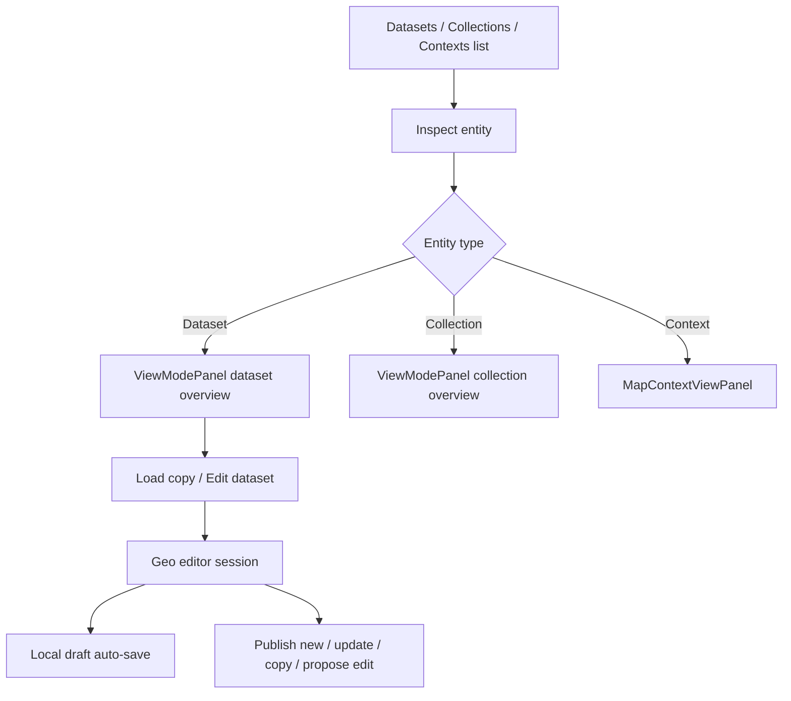
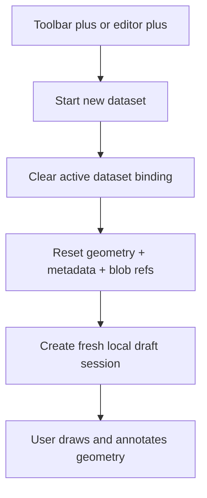
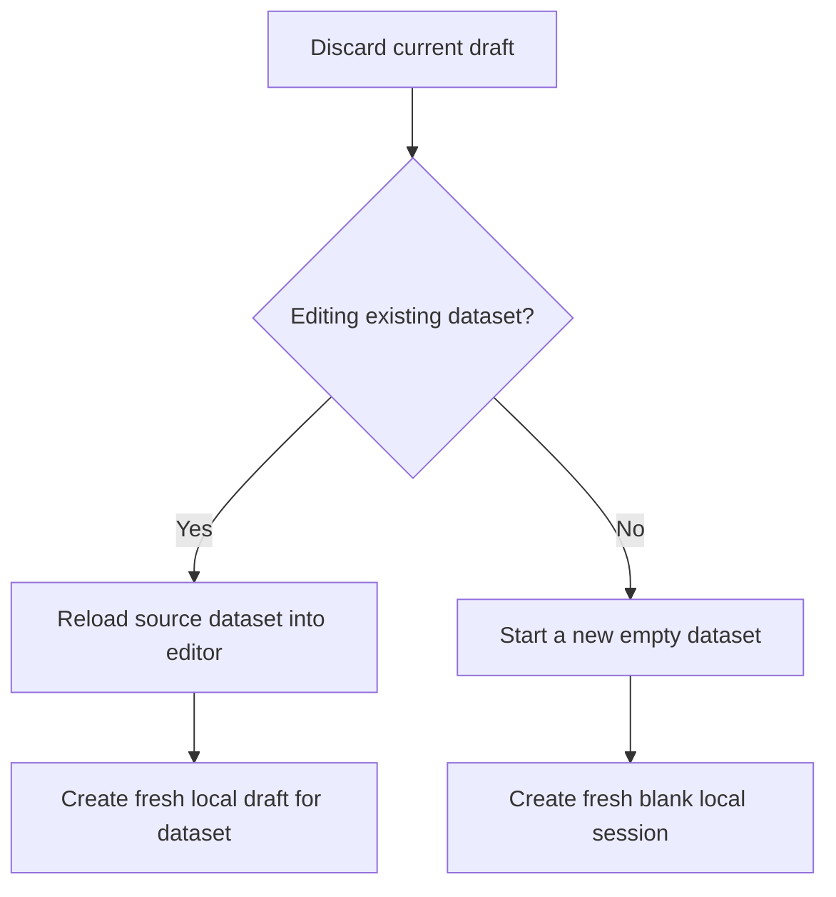

# Geo Entity Flow Review

This document captures the main `discover`, `inspect`, and `edit` flows for datasets, collections, and contexts, along with the UI/UX issues found during the refactor on March 6, 2026.

## Primary Flows

### 1. Discover -> Inspect -> Edit dataset

Description:
- Discovery starts in the dataset, collection, or context list.
- Inspect mode is read-only and should answer "what is this?" before the user commits to editing.
- Editing should always create a clearly scoped working copy so the map state reflects the selected entity, not an arbitrary persisted draft.

### 2. Start a brand new dataset

Description:
- "New dataset" must create an empty working set.
- It must not inherit the previous draft name, geometry, or attached blob state.
- The resulting draft should be a new local session, not a mutation of the last dataset draft.

### 3. Discard current edit state

Description:
- Discard should remove the current working copy and reset the editor to a predictable base state.
- It should not silently load a different persisted draft unless the user explicitly selects it from the draft picker.

## Main Findings

### Fixed in this refactor

- Draft resurrection: entering edit mode could auto-load the most recent localStorage draft and replace the intended dataset state with stale geometry.
- Misleading `+` action in the editor panel: it duplicated the current draft metadata instead of starting a new empty dataset.
- Broken discard behavior: deleting the active draft often reloaded another persisted draft or recreated the same state, which made the button feel ineffective.
- Draft label drift: draft labels could diverge from the current dataset metadata because draft title fields and `collectionMeta` were updated separately.
- Sidebar visual inconsistency: the entity nav used high-contrast red/orange styling that read like a temporary debug state rather than part of the main navigation system.

### Remaining UX inconsistencies to consider

- There are still multiple entry points for "start editing":
  the toolbar session button, sidebar entity switch, dataset row actions, and the editor-panel `+`.
- Inspect/edit mode is represented both globally in the sidebar header and locally inside the editor panel with the `View` button.
- Collection/context creation is available from both the entity rail and the corresponding list views, which is useful but currently not explained by the UI.

## Current Rules After Refactor

- Loading a dataset for editing creates a fresh draft for that dataset instead of auto-restoring an arbitrary older draft.
- Starting a new dataset creates a unique blank local draft session.
- Discarding the current draft resets to the dataset source or a blank session, depending on what is being edited.
- Older local drafts remain available in the draft picker, but they are only loaded when the user selects them explicitly.
