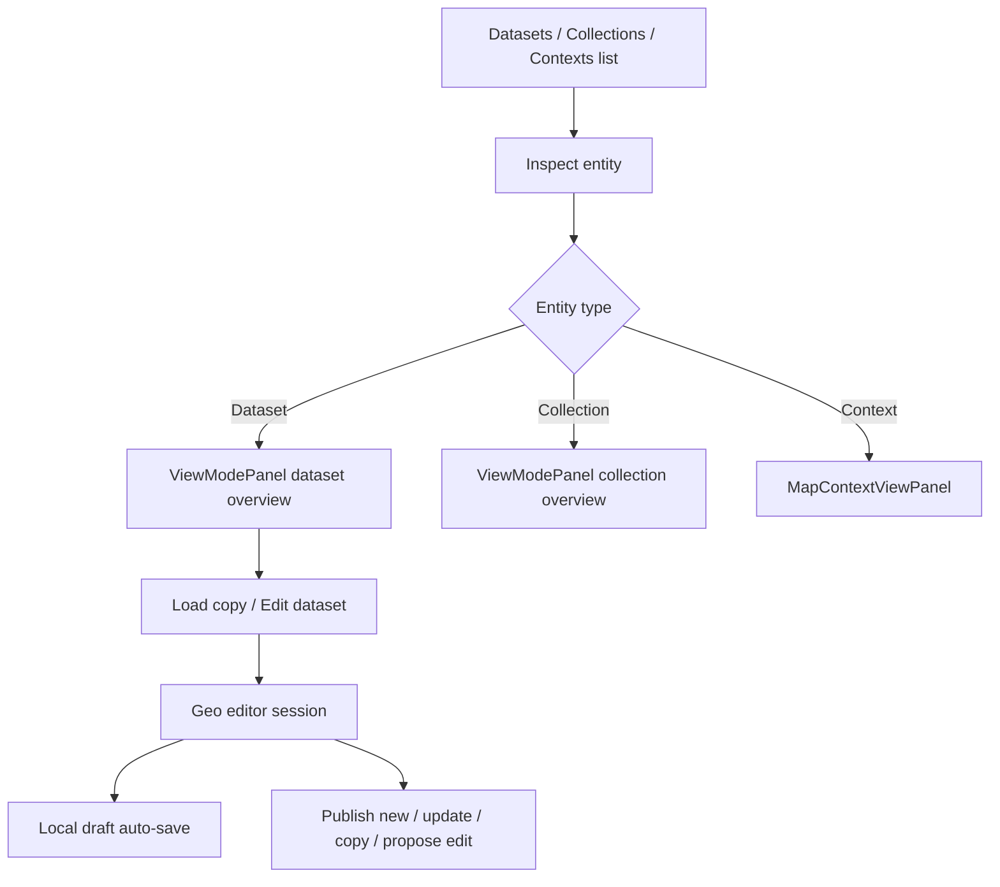
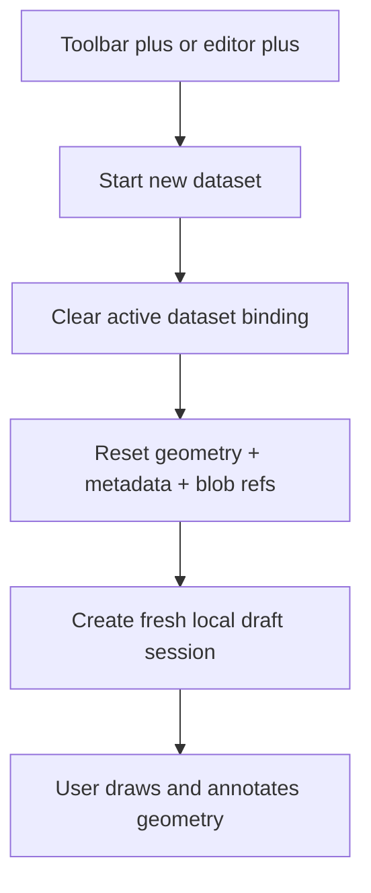
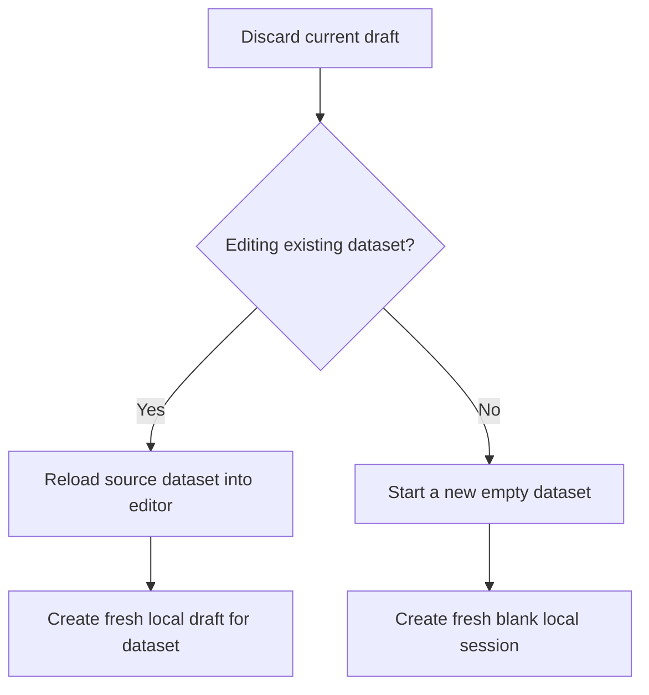
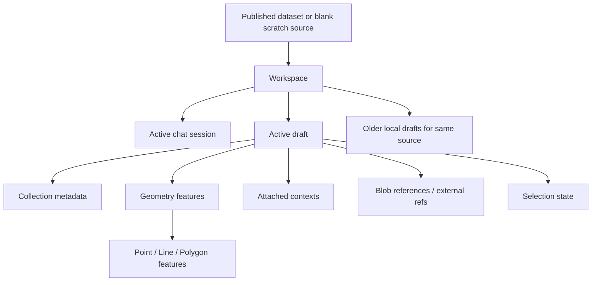
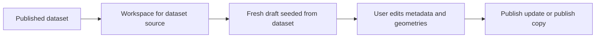
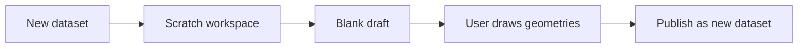
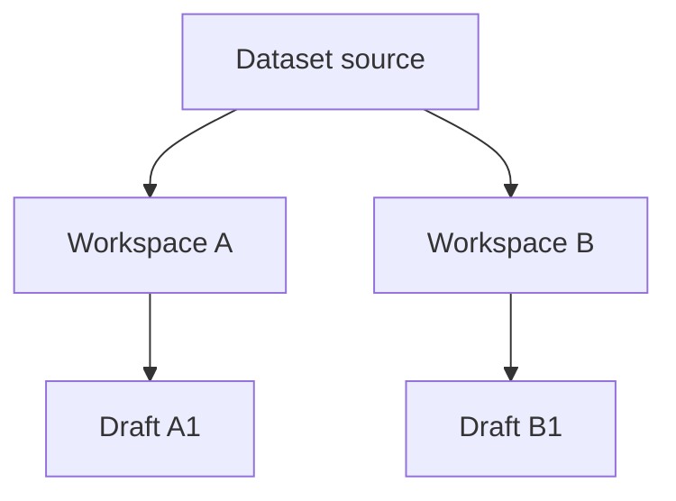
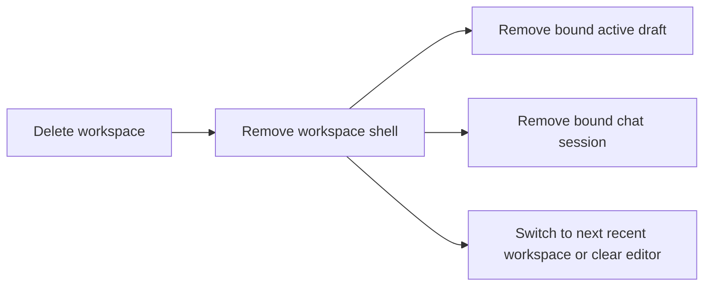

# Geo Entity Flow Review

This document captures the main `discover`, `inspect`, and `edit` flows for datasets, collections, and contexts, along with the UI/UX issues found during the refactor on March 6, 2026.

## Primary Flows

### 1. Discover -> Inspect -> Edit dataset

Description:
- Discovery starts in the dataset, collection, or context list.
- Inspect mode is read-only and should answer "what is this?" before the user commits to editing.
- Editing should always create a clearly scoped working copy so the map state reflects the selected entity, not an arbitrary persisted draft.

### 2. Start a brand new dataset

Description:
- "New dataset" must create an empty working set.
- It must not inherit the previous draft name, geometry, or attached blob state.
- The resulting draft should be a new local session, not a mutation of the last dataset draft.

### 3. Discard current edit state

Description:
- Discard should remove the current working copy and reset the editor to a predictable base state.
- It should not silently load a different persisted draft unless the user explicitly selects it from the draft picker.

## Main Findings

### Fixed in this refactor

- Draft resurrection: entering edit mode could auto-load the most recent localStorage draft and replace the intended dataset state with stale geometry.
- Misleading `+` action in the editor panel: it duplicated the current draft metadata instead of starting a new empty dataset.
- Broken discard behavior: deleting the active draft often reloaded another persisted draft or recreated the same state, which made the button feel ineffective.
- Draft label drift: draft labels could diverge from the current dataset metadata because draft title fields and `collectionMeta` were updated separately.
- Sidebar visual inconsistency: the entity nav used high-contrast red/orange styling that read like a temporary debug state rather than part of the main navigation system.

### Remaining UX inconsistencies to consider

- There are still multiple entry points for "start editing":
  the toolbar session button, sidebar entity switch, dataset row actions, and the editor-panel `+`.
- Inspect/edit mode is represented both globally in the sidebar header and locally inside the editor panel with the `View` button.
- Collection/context creation is available from both the entity rail and the corresponding list views, which is useful but currently not explained by the UI.

## Current Rules After Refactor

- Loading a dataset for editing creates a fresh draft for that dataset instead of auto-restoring an arbitrary older draft.
- Starting a new dataset creates a unique blank local draft session.
- Discarding the current draft resets to the dataset source or a blank session, depending on what is being edited.
- Older local drafts remain available in the draft picker, but they are only loaded when the user selects them explicitly.

## Workspace Model

- A workspace is now the top-level editing unit.
- Each workspace owns one source (`dataset:*` or scratch session), one active draft, and one bound chat session.
- Starting a new dataset creates a new scratch workspace instead of replacing the previous one.
- Switching workspaces restores the bound draft and switches the AI chat to the matching conversation.
- Chat no longer operates on an implicit global editor state. It operates on the active workspace.

## Workspace, Draft, Geometry: Mental Model

This is the main distinction the UI now needs to communicate:

- A `workspace` is a working session.
- A `draft` is a saved editor snapshot inside that session lineage.
- A `geometry` is an individual feature inside the current draft.
- A `dataset` is the publishable GeoJSON-style result that may eventually be written to Nostr.

In practical terms:

- The workspace answers: "Which editing thread am I in?"
- The draft answers: "Which saved local revision of that thread am I looking at?"
- The geometries list answers: "Which actual features are inside this revision?"

### Relationship Diagram

Description:

- The source is either a published dataset (`dataset:*`) or a blank scratch source (`session:*`).
- A workspace points at that source and keeps one active chat thread and one active draft.
- The active draft contains the actual editable state: metadata, feature list, attached contexts, and selection.
- The geometries list in the editor is not a list of workspaces or drafts. It is a list of features inside the active draft.

### Glossary

#### Workspace

A workspace is the top-level container for one editing thread.

It stores:

- Which source this thread came from.
- Which draft is currently active for that thread.
- Which chat session belongs to that thread.
- The label shown in the workspace selector.

Examples:

- "Edit the published Vienna boundary dataset."
- "Start a brand new untitled geometry set."
- "Create an alternative version of the same source without losing the original draft."

#### Draft

A draft is a locally persisted revision for one source.

It stores:

- Collection metadata such as name and description.
- The current feature array.
- The selected features.
- Timestamps.

Important nuance:

- Drafts are grouped by `sourceId`.
- The `Local drafts` dropdown shows drafts for the current source only.
- A workspace chooses one of those drafts as its active draft.

This means a workspace is not "the same thing" as a draft. A workspace is the session shell; a draft is the saved editor state inside it.

#### Geometry

A geometry is a single feature inside the active draft.

Examples:

- One polygon boundary.
- One route line.
- One point marker.

If the geometries panel says `Geometries (1)`, that means the current draft contains one feature. It does not mean there is one workspace or one draft.

#### Dataset

A dataset is the publishable output.

It may start from:

- An existing published dataset you opened for editing.
- A scratch workspace that has never been published.

When you publish, the current draft state is what becomes the next dataset payload.

### UI Mapping

The main UI sections now correspond to different layers of the model:

- `Workspaces` selector:
  switches between editing threads.
- `Local drafts` selector:
  switches between saved local revisions for the current source.
- `Dataset info`:
  edits the metadata of the active draft.
- `Geometries`:
  lists and edits the features inside the active draft.
- `Chat`:
  is bound to the active workspace, not to the global editor singleton.

### Why Both Workspace And Draft Exist

Before the refactor, the product behaved as if there were only "the current editor state" plus a pile of local drafts. That created several problems:

- Opening one entity could silently resurrect stale geometry from another local draft.
- Starting `New` could overwrite the user's sense of what session they were in.
- Chat edits had no clear session boundary.

The workspace layer solves that by giving the user an explicit editing thread.

The draft layer still matters because local persistence and version-like recovery are useful inside that thread.

So the model is:

- Workspace = session boundary.
- Draft = recoverable local revision.
- Geometry = feature inside that revision.

### Common Scenarios

#### 1. Edit an existing published dataset

What the user should understand:

- The published dataset is the base.
- The workspace is the editing thread for that base.
- The draft is the mutable local copy.
- The geometries are the actual editable shapes inside that copy.

#### 2. Start a brand new dataset

What the user should understand:

- There is no published source yet.
- The workspace still exists because the user is in a new editing thread.
- The draft holds the blank metadata and the newly drawn geometries.

#### 3. Keep two alternatives alive at once

What the user should understand:

- Two workspaces may originate from the same conceptual subject but remain separate editing threads.
- This is why pressing `New` should not make the previous untitled work disappear.
- Each workspace keeps its own chat and active draft binding.

#### 4. Delete a workspace

What the user should understand:

- Deleting a workspace means deleting that editing thread.
- It is stronger than just switching drafts.
- The goal is to remove the session and its attached local editing context cleanly.

### Rules We Should Keep Stable

- Switching workspace should restore the matching draft, metadata, geometries, and chat session together.
- Switching draft should only change the local revision inside the same source lineage.
- `New` should create a new scratch workspace, not mutate the current one.
- The geometries list should always reflect the active draft only.
- Chat tool actions should apply to the active workspace only.

### Suggested Short Help Copy For The UI

If we want to explain this in-product, this is the level of brevity that is probably right:

- `Workspace`: your current editing thread.
- `Local drafts`: saved revisions for this source.
- `Geometries`: features inside the selected draft.

That copy is short enough for helper text or tooltips, while the model above explains the full behavior.
