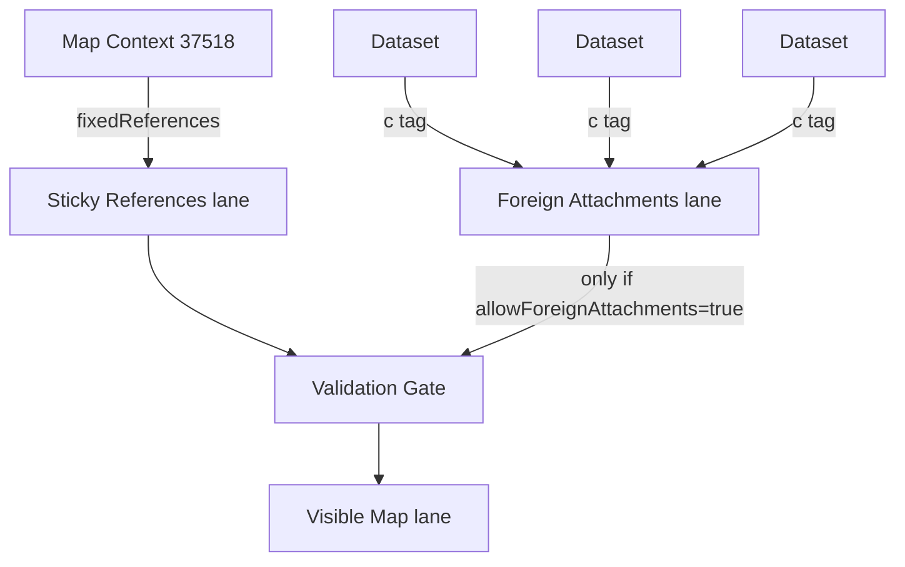

# Map Context Simple Explainer

This document is intentionally simple. It is meant to help another LLM generate diagrams that explain the `37518` map context entity to someone seeing the model for the first time.

## One-Sentence Definition

A map context is a shared lens over datasets: it tells the app which datasets belong, which ones are pinned by the author, and whether those datasets must satisfy validation rules.

## The Most Important Point

A context is not primarily a geometry container.

It is a policy and curation object.

It can reference geometry, but it mainly answers three questions:

1. Which datasets should always appear here?
2. Can outside datasets attach themselves here?
3. If they do, what rules must they satisfy?

## Mental Model

Think of a context as a museum room definition, not as the paintings.

- Datasets are the paintings.
- The context is the room plan, wall labels, entry rules, and curation rules.
- Comments are conversations happening inside the room.

## The Three Jobs Of A Context

### 1. Curation

The context can pin authored references via `fixedReferences`.

These are the datasets or features that the context author says are part of the context no matter what.

This is the sticky lane.

### 2. Admission Control

Datasets can self-attach to a context by adding a `c` tag with the context coordinate.

But the context decides whether those foreign attachments count:

- `allowForeignAttachments = false`
  means ignore them.

- `allowForeignAttachments = true`
  means admit them into the foreign lane.

### 3. Validation

The context can also act like a rulebook.

It can define:

- allowed geometry types
- a JSON schema for feature properties
- a validation mode:
  `none`, `optional`, or `required`

That means a context can be:

- only a taxonomy
- only a validator
- both at once

## The Three Context Modes

### Taxonomy

Purpose:
classify and group datasets.

Behavior:

- no schema enforcement
- no geometry validation
- useful for thematic grouping

Example:
"Hiking trails in Austria"

### Validation

Purpose:
enforce structure and quality.

Behavior:

- validates geometry types and feature properties
- useful for standardization and review

Example:
"Official park boundaries must be polygons and must include source + license"

### Hybrid

Purpose:
both group and validate.

Behavior:

- acts like a thematic context
- also acts like a schema/geometry gate

Example:
"Protected wetlands dataset set with required schema"

## The Two-Lane Model

Every context view should be explained with two input lanes and one output lane.

### Sticky lane

Source:
`fixedReferences`

Meaning:
authored, curated references that belong to the context view because the context author explicitly pinned them.

### Foreign lane

Source:
datasets whose `c` tags include the context coordinate

Meaning:
datasets that claim membership in the context

Gate:
only counted when `allowForeignAttachments = true`

### Visible map lane

Source:
union of sticky lane and foreign lane

Filter:
may be reduced by validation in `strict` mode

## Why Contexts Feel Complex

They combine four concerns in one entity:

1. naming and description
2. curation via sticky references
3. permissions or policy via `allowForeignAttachments`
4. validation via schema and geometry rules

That is why the best diagram is not a single box. The best diagram shows the context as a control object sitting above dataset lanes.

## The Critical Addressing Difference

There are two different ways a context refers to datasets or is referred to by datasets.

### Dataset to context

Datasets attach to contexts with raw coordinates:

`37518:<context-pubkey>:<context-d>`

This lives in dataset `c` tags.

### Context to dataset

Contexts pin datasets using `fixedReferences`.

In the current app implementation these are usually `naddr1...` references, not raw coordinates.

This difference matters and should be visible in technical diagrams.

## Simple Lifecycle

### Context creation

1. Author creates a context.
2. Context gets a stable `d` tag.
3. Context publishes descriptive metadata and optional validation rules.

### Dataset association

Datasets enter a context in two ways:

1. The context author pins them.
2. Dataset publishers self-attach them with `c` tags.

### Context rendering

1. App loads latest context event by `kind:pubkey:d`.
2. App resolves sticky refs.
3. App gathers foreign attachments if allowed.
4. App validates datasets if the context mode supports validation.
5. App renders the visible map lane.

## Publishing Rule

If a dataset is being published with a required validation context attached, the publish flow blocks until the dataset passes that context's rules.

This makes contexts more than folders. They can act like publish-time gates.

## Context Anatomy

Use this field breakdown for diagrams.

### Identity

- kind `37518`
- `d` tag
- address `37518:<pubkey>:<d>`

### Human-facing fields

- `name`
- `description`
- `descriptionFormat`
- `image`

### Behavior fields

- `contextUse`
- `validationMode`
- `allowForeignAttachments`

### Curation fields

- `fixedReferences`
- `parent`

### Validation fields

- `geometryConstraints.allowedTypes`
- `schemaDialect`
- `schema`

## Diagram Recipe For Another LLM

Use this exact framing:

Draw the map context as a control tower above two dataset lanes. The left lane is Sticky References from fixedReferences. The right lane is Foreign Attachments from dataset c tags. Both feed into a Visible Map Lane. Put a validation gate between the two input lanes and the visible lane, but only for validation or hybrid contexts. Add three badges on the context box: taxonomy, validation, hybrid. Add a switch labeled allowForeignAttachments controlling whether the foreign lane is open or closed.

## Mermaid Seed



## Image Prompt A

Create an educational architecture diagram explaining a Map Context entity in a Nostr-native mapping app. Show the context as a central control object, not as a geometry object. Break it into four labeled sections inside the box: identity, curation, attachment policy, validation rules. Below it show two input lanes: Sticky References and Foreign Attachments. Show Foreign Attachments controlled by a switch labeled allowForeignAttachments. Show both lanes flowing through a Validation Gate into a final Visible Map Lane. Use a clean technical infographic style with white background, slate and blue accents, and very clear labels.

## Image Prompt B

Create a simplified concept diagram titled "A context is a lens, not the data". Show datasets as cards, a context as a curator/rulebook panel, and comments as speech bubbles attached to either the context or the datasets. Emphasize that datasets contain geometry, while the context controls grouping and validation. Include three mode pills: taxonomy, validation, hybrid.

## Graph Extraction Format

```text
NODES
MapContext(kind=37518, role=control_object)
StickyLane(role=authored_references)
ForeignLane(role=self_attached_datasets)
ValidationGate(role=geometry_and_schema_rules)
VisibleMapLane(role=rendered_dataset_set)
Dataset(role=geometry_payload)

EDGES
MapContext --pins--> StickyLane
Dataset --self_attaches_via_c_tag--> ForeignLane
MapContext --opens_or_closes--> ForeignLane
StickyLane --feeds--> ValidationGate
ForeignLane --feeds--> ValidationGate
ValidationGate --outputs--> VisibleMapLane
```
