# Mermaid Entity Cards

This is a Mermaid version of the "Earthly Geo Entities" poster. It aims for the same card-based layout and tone, within Mermaid's styling limits.

```mermaid
%%{init: {
  "theme": "base",
  "themeVariables": {
    "background": "#f6f1e8",
    "primaryColor": "#1f4467",
    "primaryTextColor": "#f8fafc",
    "primaryBorderColor": "#1f4467",
    "lineColor": "#506477",
    "secondaryColor": "#6fa8aa",
    "secondaryTextColor": "#f8fafc",
    "tertiaryColor": "#d79a52",
    "tertiaryTextColor": "#f8fafc",
    "fontFamily": "ui-sans-serif, system-ui, -apple-system, BlinkMacSystemFont, Segoe UI, sans-serif"
  },
  "flowchart": {
    "curve": "basis",
    "nodeSpacing": 28,
    "rankSpacing": 28,
    "padding": 14
  }
}}%%
flowchart TB

    title["Earthly Geo Entities"]
    subtitle["What each Nostr entity does"]

    subgraph cards[" "]
        direction LR

        subgraph card1[" "]
            direction TB
            d_h["🗺️<br/><b>Dataset</b><br/>Kind: 37515"]
            d_b["• Stores the GeoJSON FeatureCollection<br/>• Carries bbox, geohash, checksum, metadata<br/>• Can attach itself to contexts with c tags"]
        end

        subgraph card2[" "]
            direction TB
            c_h["🧭<br/><b>Map Context</b><br/>Kind: 37518"]
            c_b["• Acts as a lens over datasets<br/>• Pins sticky refs and controls foreign attachments<br/>• Can validate geometry and schema rules"]
        end

        subgraph card3[" "]
            direction TB
            cm_h["💬<br/><b>Geo Comment</b><br/>Kind: 37517"]
            cm_b["• Adds threaded discussion to a dataset or context<br/>• Can include optional annotation GeoJSON<br/>• Supports replies with NIP-22 threading"]
        end

        subgraph card4[" "]
            direction TB
            p_h["✏️<br/><b>Geo Edit Proposal</b><br/>Kind: 37519"]
            p_b["• Suggests full replacement geometry for a dataset<br/>• Targets an existing dataset lineage<br/>• Lets the owner review before applying"]
        end

        subgraph card5[" "]
            direction TB
            s_h["✅<br/><b>Proposal Status</b><br/>Kind: 1630-1633"]
            s_b["• Tracks draft, open, applied, or closed state<br/>• References the proposal with a tags<br/>• Separates review state from geometry payload"]
        end
    end

    callout["37516 collections are deprecated in the active model"]
    footer["Datasets carry geometry. Contexts organize and validate it. Comments discuss it. Proposals change it."]

    title --- subtitle
    subtitle --- cards
    cards --- footer
    callout -.-> card5

    classDef titleClass fill:transparent,stroke:transparent,color:#1f2937,font-size:38px,font-weight:bold;
    classDef subtitleClass fill:transparent,stroke:transparent,color:#1f2937,font-size:20px;
    classDef wrapper fill:transparent,stroke:transparent,color:#1f2937;

    classDef blueHead fill:#1f4467,stroke:#1f4467,color:#f8fafc,font-size:18px,font-weight:bold;
    classDef tealHead fill:#6fa8aa,stroke:#6fa8aa,color:#f8fafc,font-size:18px,font-weight:bold;
    classDef amberHead fill:#d79a52,stroke:#d79a52,color:#f8fafc,font-size:18px,font-weight:bold;
    classDef body fill:#fcfbf7,stroke:#8fa0ad,color:#1f2937,font-size:14px,text-align:left;
    classDef calloutClass fill:#fcfbf7,stroke:#d79a52,color:#3f3f46,font-size:14px;
    classDef footerClass fill:#fcfbf7,stroke:#8fa0ad,color:#1f2937,font-size:16px,font-weight:bold;

    class title titleClass;
    class subtitle subtitleClass;
    class cards,card1,card2,card3,card4,card5 wrapper;

    class d_h,c_h blueHead;
    class cm_h tealHead;
    class p_h,s_h amberHead;

    class d_b,c_b,cm_b,p_b,s_b body;
    class callout calloutClass;
    class footer footerClass;
```

## Notes

- Mermaid cannot reproduce the poster exactly, especially the rounded card chrome and fine typography.
- The closest approximation is to split each card into a colored header node and a white body node.
- If you want, I can also add a compact version of this directly into [README.md](/Users/schlaus/workspace/earthly/README.md).
