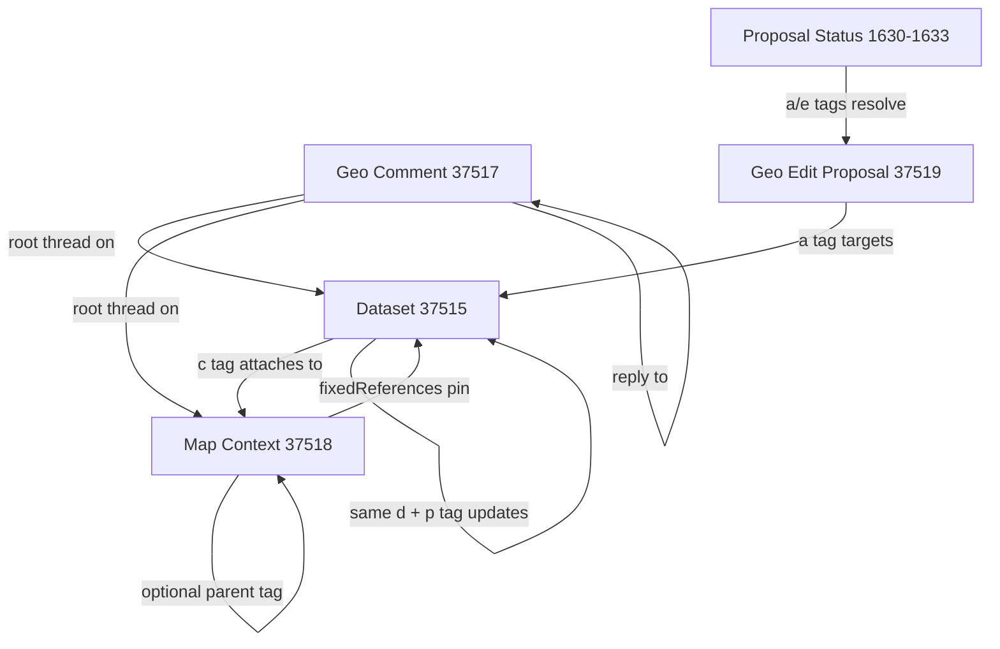

# Nostr Geo Entities Architecture

This document is written as a compact source for both humans and downstream LLMs that need to generate architecture diagrams for Earthly.

It reflects the current app model implemented in:

- `SPEC.md`
- `src/lib/ndk/NDKGeoEvent.ts`
- `src/lib/ndk/NDKMapContextEvent.ts`
- `src/lib/ndk/NDKGeoEditProposalEvent.ts`
- `src/lib/ndk/NDKGeoCommentEvent.ts`
- `src/lib/context/references.ts`
- `src/lib/context/validation.ts`
- `src/features/social/hooks/useGeoComments.ts`
- `src/features/social/hooks/useGeoProposals.ts`

## Current Model In One Paragraph

Earthly has one primary geometry entity, the dataset (`37515`). Contexts (`37518`) do not store foreign geometry themselves; they define how datasets are grouped, pinned, and validated. Comments (`37517`) attach discussion and optional annotation geometry to either datasets or contexts. Edit proposals (`37519`) attach proposed replacement geometry to datasets and are resolved later through status events (`1630` to `1633`).

## Important Reality Check

- `37516` collections are deprecated in the active model.
- Some legacy `collection` tags still exist on datasets and are carried forward during proposal acceptance for compatibility.
- Some older text in the spec and comments wrapper still says "dataset or collection", but the current UI and hooks target datasets or contexts.
- The runtime architecture is dataset-centric and context-centric, not collection-centric.

## Entity Table

| Entity | Kind | Canonical address | Primary payload | Main outgoing links | Main incoming links |
| --- | --- | --- | --- | --- | --- |
| Dataset | `37515` | `37515:<pubkey>:<d>` | GeoJSON `FeatureCollection` | `c` tags to contexts, optional `collection` tags, optional `blob` tags, `p` tag to previous dataset version | comments, proposals, context fixed refs, proposal acceptance flow |
| Map Context | `37518` | `37518:<pubkey>:<d>` | JSON config object | `fixedReferences`, optional `parent`, optional schema and geometry constraints | dataset `c` tags, comments |
| Geo Comment | `37517` | `37517:<pubkey>:<d>` | `{ text, geojson? }` | NIP-22 reply threading to root and parent | dataset or context root, parent comment |
| Geo Edit Proposal | `37519` | `37519:<pubkey>:<d>` | full replacement `FeatureCollection` | `a` tag to target dataset, `p` tag to owner, `base-version` tag to dataset event ID | status events, dataset owner review flow |
| Proposal Status | `1630`-`1633` | regular event id | reason string in `content` | `a` tag to proposal, optional `e` tag to proposal event, `p` tag to proposal author | proposal resolution flow |

## Core Dependency Graph

### Node Definitions

- Dataset: the only first-class entity that directly holds publishable map geometry.
- Context: a policy and curation layer over datasets.
- Comment: a social/threading layer over datasets or contexts.
- Proposal: a pending replacement geometry for a dataset.
- Proposal status: a small state event that changes a proposal's lifecycle state.

### Edge Definitions

- Dataset -> Context
  Relation: self-attachment.
  Mechanism: dataset `c` tags store raw context coordinates.
  Meaning: "This dataset belongs in this context if the context allows foreign attachments."

- Context -> Dataset
  Relation: sticky authored reference.
  Mechanism: `fixedReferences`.
  Meaning: "This dataset or feature should always appear in the context view."

- Context -> Context
  Relation: optional hierarchy.
  Mechanism: `parent` tag.
  Meaning: "This context extends or nests under another context."

- Comment -> Dataset or Context
  Relation: root discussion target.
  Mechanism: NIP-22 `K`, `A`, `P` tags.
  Meaning: "This thread belongs to this root entity."

- Comment -> Comment
  Relation: reply.
  Mechanism: NIP-22 `k`, `a`, `e`, `p` tags.
  Meaning: "This comment is a reply to another comment in the same thread."

- Proposal -> Dataset
  Relation: proposed replacement.
  Mechanism: `a` tag, `p` tag, `base-version` tag.
  Meaning: "Replace this dataset lineage with this geometry if accepted."

- Proposal status -> Proposal
  Relation: state transition.
  Mechanism: `a` and optional `e` tags.
  Meaning: "This proposal is open, draft, applied, or closed."

- Dataset update -> previous dataset
  Relation: version lineage.
  Mechanism: same `d` tag plus `p` tag to prior event id.
  Meaning: "This is a later version of the same dataset lineage."

## Address Forms

Use these exact forms in diagrams.

- Dataset coordinate: `37515:<dataset-author-pubkey>:<dataset-d>`
- Context coordinate: `37518:<context-author-pubkey>:<context-d>`
- Proposal coordinate: `37519:<proposal-author-pubkey>:<proposal-d>`
- Context fixed reference address in app practice: usually `naddr1...`
- Comment root addressing: NIP-22 root tags point to a dataset or context address

Important distinction:

- Dataset `c` attachments use raw coordinates like `37518:<pubkey>:<d>`.
- Context `fixedReferences` are resolved from `naddr` values in the current app code.

## Runtime Composition Rules

### 1. Replaceable materialization

Datasets and contexts are treated as parameterized replaceable lineages in the UI.

Algorithm:

1. Subscribe to all matching events.
2. Group by `kind:pubkey:d`.
3. Keep the newest event by `created_at`.
4. Break ties by event id.
5. Use that event as the current materialized entity.

### 2. Context view assembly

A context view has two lanes and one result set.

- Sticky lane:
  datasets resolved from the context's `fixedReferences`.

- Foreign lane:
  datasets whose `contextReferences` contain the context coordinate, but only when `allowForeignAttachments=true`.

- Visible map lane:
  deduplicated union of sticky lane and foreign lane, optionally filtered by validation.

### 3. Validation behavior

Validation applies only when context use is `validation` or `hybrid`.

Inputs:

- `geometryConstraints.allowedTypes`
- `schemaDialect`
- `schema`
- viewer filter mode `off | warn | strict`

Outputs per dataset:

- `valid`
- `invalid`
- `unresolved`

Publish-time rule:

- if a dataset is being published with one or more required validation contexts attached, publication is blocked when validation fails.

### 4. Proposal acceptance

Accepting a proposal does not mutate the proposal event.

Instead the app:

1. Creates a new dataset event.
2. Copies the proposal geometry into the new dataset.
3. Carries forward target metadata:
   hashtags, collection references, context references, relay hints.
4. Publishes it as an update in the target dataset lineage.
5. Publishes proposal status `1631` (`applied`).

### 5. Comment threading

Comments are normal events with NIP-22 threading tags.

- top-level comment:
  root tags and parent tags both point at the dataset or context root.

- reply:
  root tags still point at the root dataset/context, while parent tags point at the immediate parent comment.

Comments may optionally include annotation GeoJSON, which gives them a map-visible dimension that ordinary text comments do not have.

## Simple Flow Summaries

### Dataset publishing flow

1. User edits local geometry.
2. App builds a `FeatureCollection`.
3. App attaches context coordinates if selected.
4. App computes bbox, geohash, size, checksum.
5. App publishes dataset `37515`.

### Context scoping flow

1. User focuses a context.
2. App resolves sticky refs from `fixedReferences`.
3. App finds foreign attached datasets via dataset `c` tags.
4. App unions both sets.
5. App validates them if the context is `validation` or `hybrid`.
6. App renders the visible map lane.

### Proposal review flow

1. User opens a dataset.
2. App subscribes to proposals whose `a` tag points at the dataset.
3. App subscribes to status events for those proposals.
4. App overlays proposal geometry for review.
5. Owner accepts or rejects.

### Comment flow

1. User posts a top-level comment on dataset or context.
2. App creates root threading tags.
3. Replies attach to parent comments.
4. Optional annotation geometry can be toggled on the map.

## Mermaid Seed

Use this when a diagram model supports Mermaid-like graph grammar.



## Image Generation Brief

Use the following if you want another LLM to produce a clean architecture graphic.

### Prompt A: high-level entity graph

Create a clean systems architecture diagram for a Nostr-native collaborative mapping app called Earthly. Show five entity types as labeled boxes: Dataset 37515, Map Context 37518, Geo Comment 37517, Geo Edit Proposal 37519, and Proposal Status 1630-1633. Make Dataset the primary geometry entity in the center. Show Dataset -> Context via c tag self-attachment. Show Context -> Dataset via fixedReferences as sticky references. Show Comment attaching to Dataset or Context as threaded discussion with optional annotation geometry. Show Proposal targeting Dataset as full replacement geometry. Show Proposal Status resolving Proposal state. Add a small note that 37516 collections are deprecated in the active model.

### Prompt B: runtime flow

Create a flow diagram showing Earthly runtime composition. Left column: relay subscriptions. Middle column: latest-by-coordinate materialization for datasets and contexts. Right column: context view assembly with sticky lane, foreign lane, validation stage, and final visible map lane. Separate bottom lane: proposal review flow and comment thread flow. Use a crisp technical style, white background, clear arrows, minimal decoration.

## Graph Extraction Format

Use this literal node-edge list for graph tooling.

```text
NODES
Dataset(kind=37515, role=primary_geometry_entity)
MapContext(kind=37518, role=taxonomy_validation_lens)
GeoComment(kind=37517, role=threaded_discussion_with_optional_geojson)
GeoEditProposal(kind=37519, role=full_replacement_candidate)
ProposalStatus(kind=1630|1631|1632|1633, role=proposal_lifecycle_state)

EDGES
Dataset --c_tag_attach--> MapContext
MapContext --fixed_reference_pin--> Dataset
MapContext --parent_hierarchy--> MapContext
GeoComment --root_target--> Dataset
GeoComment --root_target--> MapContext
GeoComment --reply_to--> GeoComment
GeoEditProposal --targets--> Dataset
ProposalStatus --updates_state_of--> GeoEditProposal
Dataset --updates_same_lineage--> Dataset
```
