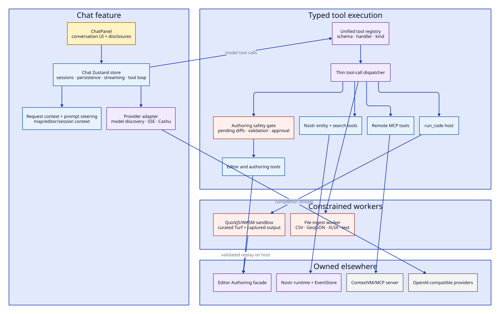
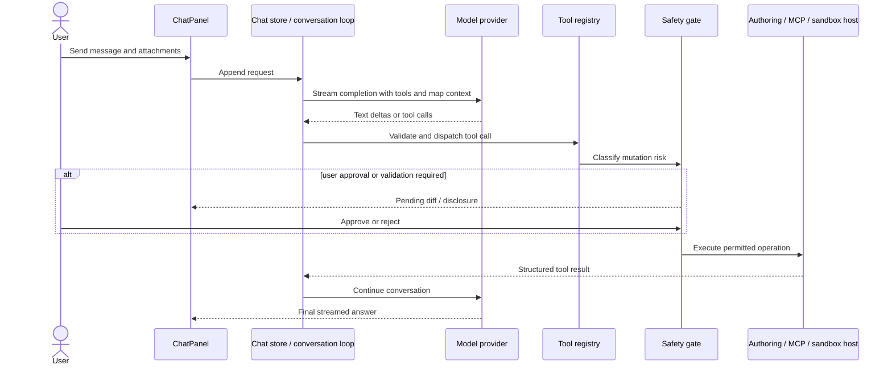

# AI chat and tool execution architecture

Earthly's chat is a client-side agent runtime coupled to the map through narrow tools. It streams an OpenAI-compatible model response, executes typed tool calls, and returns tool results until the conversation completes. Geometry writes pass through safety gates and the editor's `Authoring` facade.

## Structural view

## End-to-end sequence

## Responsibility map

| Module | Responsibility |
| --- | --- |
| [`ChatPanel.tsx`](../../src/features/chat/ChatPanel.tsx) | Conversation presentation, attachments, disclosures, composer state, and user approvals |
| [`store.ts`](../../src/features/chat/store.ts) | Sessions, persisted history, settings, streaming lifecycle, context budgets, and the repeated model/tool loop |
| [`routstr.ts`](../../src/features/chat/routstr.ts) | OpenAI-compatible provider configuration, model discovery, SSE streaming, and Routstr Cashu payment/refund behavior |
| [`requestContext.ts`](../../src/features/chat/requestContext.ts) | Bounded map, editor, selection, workspace, and session context supplied to the model |
| [`tools/registry.ts`](../../src/features/chat/tools/registry.ts) | The canonical typed registry: definition, schema, handler, and execution kind |
| [`tools/execute.ts`](../../src/features/chat/tools/execute.ts) | Thin dispatcher and integrity checks around a registered call |
| [`safeEditing/`](../../src/features/chat/safeEditing) | Mutation interception, bindings, pending diffs, validation, bulk/code gates, and approval UI state |
| [`sandbox/`](../../src/features/chat/sandbox) | QuickJS/WASM execution with curated Turf, bounded input/output, and host-side replay |
| [`ingest/`](../../src/features/chat/ingest) | Worker-based parsing for CSV, GeoJSON, XLSX, and text attachments |
| [`tools/mcp-sync.ts`](../../src/features/chat/tools/mcp-sync.ts) | Discovers and synchronizes ContextVM tool definitions |

## Tool kinds

The registry supports several implementations behind one tool-call contract:

- editor operations;
- host built-ins;
- remote MCP tools;
- authoring primitives;
- Nostr scroll/search operations;
- the code interpreter.

This is a real seam: implementations have different security, latency, and availability characteristics, while the conversation loop consumes one validated registry.

## Safety boundaries

### Geometry authority

AI-produced geometry does not receive a signer, wallet, Zustand `getState`, or arbitrary editor reference. Direct tools call `Authoring`; sandbox code runs in a worker and only its validated output is replayed through the host facade.

### Code execution

The QuickJS worker has a curated geospatial API and controlled snapshots. It is not a browser or Node environment. Output capture and WASM reuse are tested independently from the UI.

### Bulk changes

Potentially destructive edits can produce pending diffs and require approval. The safety layer is between tool dispatch and mutation, so adding a new UI button does not bypass it.

### Remote tools

Remote MCP tools are externally fallible. Their schemas are synchronized into the registry, but the remote server remains the owner of execution and availability.

## Invariants

1. The registry is the canonical mapping from a model-visible tool name to its schema and handler.
2. The dispatcher does not reimplement tool behavior.
3. Model output is untrusted until arguments are validated and the tool's safety policy is applied.
4. Chat does not own geometry; it requests mutations through the editor boundary.
5. Conversation context is bounded and derived, not a raw dump of global stores.
6. Worker code cannot directly publish Nostr events or reach user credentials.
7. Tool results remain associated with their original call IDs and ordering.
8. Provider failures, payment failures, timeouts, and user cancellation are expected terminal states.

## Existing test surface

- Provider streaming, settings persistence, context construction, and conversation-store tests.
- Registry, dispatcher integrity, schemas, and per-tool tests.
- Authoring-gate, pending-diff, bulk-edit, and code-run safety tests.
- QuickJS sandbox, output-capture, top-level-return, WASM-reuse, and pathfinding tests.
- Ingest parser, worker client, file guards, and send-path tests.
- Browser AI scenarios for visible chat/editor journeys.

## Pressure points

### The chat store is also a conversation engine

Persistence/reactivity, provider streaming, context construction, tool-loop control, retries, and cancellation meet in one large store module.

Candidate direction: extract a framework-independent conversation runner that accepts a provider, registry, context builder, and event sink. Keep the Zustand store as session ownership and UI reactivity. This is useful only if the old control path is replaced, not wrapped.

### `ChatPanel` owns several interaction domains

The panel handles presentation, composer behavior, files, model state, tool disclosures, safety approvals, and responsive layout.

Candidate direction: partition by user-visible lifecycle—conversation transcript, composer/attachments, and operation review—while keeping state ownership in the store/runtime rather than duplicating it in child components.

### Tool context can become a service locator

As tools grow, it is tempting to add every application capability to a shared context object.

Candidate direction: keep capabilities narrow and task-oriented. Geometry tools should depend on `Authoring`, Nostr tools on explicit event/query interfaces, and remote tools on the MCP client. A tool should not receive the entire editor store for convenience.

### Provider behavior is not perfectly uniform

Routstr payment semantics, local model discovery, vision support, and custom OpenAI-compatible servers have different capabilities.

Candidate direction: keep one minimal streaming interface and model capabilities explicitly. Avoid branching on provider names throughout the conversation engine.

## Safe refactoring checklist

Preserve these journeys and boundaries:

- streaming text with cancellation and recovery;
- multiple ordered tool calls in one response;
- tool schema validation and call-ID integrity;
- user approval for gated mutations;
- code sandbox isolation and host-side replay;
- file ingest without blocking the UI thread;
- bounded request context and large-geometry optimization;
- paid-provider settlement/refund handling;
- chat settings and session restoration.
