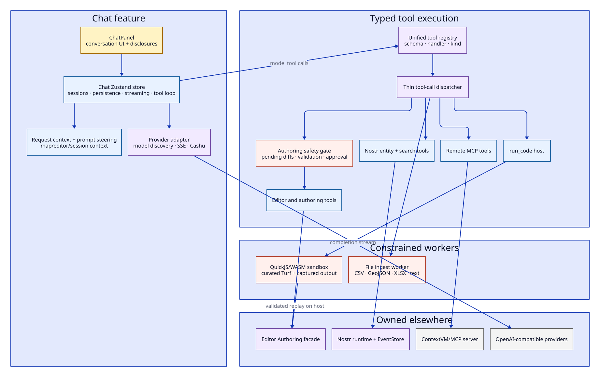
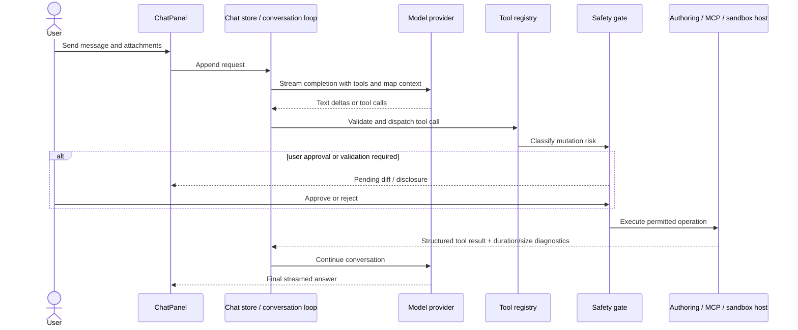

# AI chat and tool execution architecture

Earthly's chat is a client-side agent runtime coupled to the map through narrow tools. It streams an OpenAI-compatible model response, executes typed tool calls, and returns tool results until the conversation completes. Geometry writes pass through safety gates and the editor's `Authoring` facade.

Scoped Threads can work on Maps, Stories and Atlases independently of the visible panel. References
are read-only; the working set supplies explicit edit targets, with separate permission to create
new local outputs. Story/Atlas handlers share a document service for partial edits, reference and
presentation validation, prepared review, account-scoped persistence and revision-safe Undo.
Mounted human input is flushed before reads and commit checks, and only matching forms refresh.

Desktop agents can use a session-enabled subset of the same authoring tools through native WebMCP.
The [desktop-agent integration guide](./webmcp.md) describes connection setup, GeoJSON and image
delivery, revision tokens, execution ownership, and the shared review/Undo flow.

## Structural view

## End-to-end sequence

```mermaid
sequenceDiagram
    actor User
    participant UI as ChatPanel
    participant Store as Chat store / conversation loop
    participant Model as Model provider
    participant Registry as Tool registry
    participant Gate as Safety gate
    participant Host as Authoring / MCP / sandbox host

    User->>UI: Send message and attachments
    UI->>Store: Append request
    Store->>Model: Stream completion with tools and map context
    Model-->>Store: Text deltas or tool calls
    Store->>Registry: Validate and dispatch tool call
    Registry->>Gate: Classify mutation risk
    alt user approval or validation required
        Gate-->>UI: Pending diff / disclosure
        User->>Gate: Approve or reject
    end
    Gate->>Host: Execute permitted operation
    Host-->>Store: Structured tool result + duration/size diagnostics
    Store->>Model: Continue conversation
    Model-->>UI: Final streamed answer
```

## Responsibility map

| Module | Responsibility |
| --- | --- |
| [`ChatPanel.tsx`](../../src/features/chat/ChatPanel.tsx) | Conversation presentation, attachments, disclosures, composer state, and user approvals |
| [`store.ts`](../../src/features/chat/store.ts) | Sessions, persisted history, settings, streaming lifecycle, context budgets, and the repeated model/tool loop |
| [`routstr.ts`](../../src/features/chat/routstr.ts) | OpenAI-compatible provider configuration, model discovery, SSE streaming, and Routstr Cashu payment/refund behavior |
| [`requestContext.ts`](../../src/features/chat/requestContext.ts) | Bounded map, editor, selection, workspace, and session context supplied to the model |
| [`tools/registry.ts`](../../src/features/chat/tools/registry.ts) | The canonical typed registry: definition, schema, handler, and execution kind |
| [`tools/execute.ts`](../../src/features/chat/tools/execute.ts) | Thin dispatcher and integrity checks around a registered call |
| [`safeEditing/`](../../src/features/chat/safeEditing) | Mutation interception, bindings, pending diffs, validation, bulk/code gates, and approval UI state |
| [`sandbox/`](../../src/features/chat/sandbox) | QuickJS/WASM execution with curated Turf, bounded input/output, and host-side replay |
| [`ingest/`](../../src/features/chat/ingest) | Worker-based parsing for CSV, GeoJSON, XLSX, and text attachments |
| [`tools/mcp-sync.ts`](../../src/features/chat/tools/mcp-sync.ts) | Discovers and synchronizes ContextVM tool definitions |

## Saved connections and provider compatibility

Chat settings contain named connections with stable IDs, provider preset, editable API base URL,
API key, and a model preference. The active connection determines inference, model discovery,
vision detection, and wallet gating. Selecting another connection cancels the current run and
invalidates pending model discovery. A manually supplied model ID remains usable when discovery
is unavailable; wallet-funded Routstr requires discovered pricing before spending.

`connections.ts` owns presets and validation; `ConnectionSettings.tsx` owns the draft editor.
Keys enter the settings store only after Add/Save. Version 1 and 2 settings migrate each configured
endpoint into a separate connection. Version 3 backups include all connections. Plaintext export
remains an explicit recovery action; the ordinary `chat-store` persists no provider credentials.

Endpoint defaults were checked against provider documentation on **2026-09-30**:

| Provider | API base URL |
| --- | --- |
| Routstr | `https://api.routstr.com/v1` |
| OpenRouter | `https://openrouter.ai/api/v1` |
| Kimi / Moonshot | `https://api.moonshot.ai/v1` |
| Z.ai / GLM | `https://api.z.ai/api/paas/v4` |
| DeepSeek | `https://api.deepseek.com` |
| OpenAI | `https://api.openai.com/v1` |
| Anthropic / Claude compatibility API | `https://api.anthropic.com/v1` |
| Gemini compatibility API | `https://generativelanguage.googleapis.com/v1beta/openai` |
| xAI / Grok | `https://api.x.ai/v1` |
| Mistral | `https://api.mistral.ai/v1` |
| Groq | `https://api.groq.com/openai/v1` |
| Together AI | `https://api.together.xyz/v1` |
| Fireworks AI | `https://api.fireworks.ai/inference/v1` |
| Cerebras | `https://api.cerebras.ai/v1` |
| LM Studio | `http://localhost:1234/v1` |
| Ollama | `http://localhost:11434/v1` |

The custom preset accepts any OpenAI-compatible endpoint. Each preset links its official setup
guide in the UI and source. Model lists are fetched live instead of freezing vendor inventories;
GLM has an editable `glm-5.3` fallback. Regional credentials and subscription-specific endpoints
can differ. Browser access still requires provider CORS support; local servers must allow Earthly's
origin. Claude and Gemini use their documented OpenAI compatibility interfaces, not native SDKs.
Gemini's opaque tool-call signatures survive streaming and subsequent tool rounds. OpenRouter
prices display as USD, separately from Routstr sats.

### Encrypted Nostr persistence

`settingsRelay.ts` stores one signed, addressable kind **30078** event with
`d=earthly:chat-settings`, authored by the account. Its entire JSON payload is NIP-44 encrypted to
that same pubkey; tags contain no endpoints or keys. Loading checks the signature, author, address,
and schema before decrypting. Relay queries include configured content/discovery relays and the
account's cached NIP-65 write relays; publication uses normal outbox routing.

Login, reload, and **Refresh connections** restore the latest snapshot. Writes are debounced and
serialized, with encrypted local caching and visible pending/error/acknowledged states. Failed
delivery retains a dirty local copy for Retry sync. Account changes clear credentials and invalidate
in-flight operations. Unsupported or damaged envelopes are preserved rather than overwritten.
NIP-04-only signers can use encrypted local storage but need NIP-44 to sync connections to relays.

This is snapshot synchronization: concurrent device edits use Nostr's newest-event rule (lowest
event ID wins equal timestamps), not a per-connection merge. Deletion publishes a replacement
snapshot without the connection; it cannot erase historical ciphertext held by third parties or
revoke an API key at its provider. Older clients understand only the active provider compatibility
fields and should not be used to edit a v3 configuration.

### Routstr payments and wallet recovery

An empty Routstr API key selects NIP-60 funding; a supplied funded key uses bearer authentication
without requiring a wallet. Each wallet-funded request swaps fresh Cashu proofs and saves a
NIP-44 encrypted, account-scoped receipt before transmission. Refunds use the response token when
available, otherwise `POST /v1/balance/refund` with the original `X-Cashu` header, following the
[Routstr endpoint contract](https://docs.routstr.com/api/endpoints/#refund-balance).

`routstrPayments.ts` persists a received refund before redeeming it. Delays, cancellation, account
changes, and publication failures retain recovery state. **Wallet → Tools → Recover Routstr
payments** retries for the paying account; a missing request can reclaim an unsent token. These
receipts are local to the device, not included in connection backups, and must not be cleared while
payments remain pending. Fully spent or swept payments can require operator investigation.

Wallet actions capture one real signer per operation, including nested actions, instead of sharing
a proxy-backed ActionRunner that caches the first account's identity. Recovery couches and default
mint preferences are account-scoped. The old unowned couch is available only through explicit
legacy recovery. Spends are serialized in-process and across browser tabs with Web Locks; relay
acknowledgement is required before wallet events are considered durable. The old persistent
plaintext decrypted-event cache is removed; reloads unlock relay ciphertext through the signer.

The direct Cashu library is upgraded to `@cashu/cashu-ts` 4.11.0. Applesauce wallet/core 6.2.0
and signers 6.2.2 were already current when checked. Independent transitive dependencies retain
their compatible major versions.

## Tool kinds

The registry supports several implementations behind one tool-call contract:

- editor operations;
- host built-ins;
- remote MCP tools;
- authoring primitives;
- Nostr scroll/search operations;
- the code interpreter.

This is a real seam: implementations have different security, latency, and availability characteristics, while the conversation loop consumes one validated registry.

## Safety boundaries

### Geometry authority

AI-produced geometry does not receive a signer, wallet, Zustand `getState`, or arbitrary editor reference. Direct tools call `Authoring`; sandbox code runs in a worker and only its validated output is replayed through the host facade.

### Code execution

The QuickJS worker has a curated geospatial API and controlled snapshots. It is not a browser or Node environment. Output capture and WASM reuse are tested independently from the UI.

### Bulk changes

Potentially destructive edits can produce pending diffs and require approval. The safety layer is between tool dispatch and mutation, so adding a new UI button does not bypass it.

### Remote tools

Remote MCP tools are externally fallible. Their schemas are generated from the live ContextVM contract with `ctxcn` and synchronized into the registry, but the remote server remains the owner of execution and availability.

Research is intentionally federated rather than tied to one search API. `web_search` queries the VPS-local SearXNG instance, Wikipedia, and Wikidata concurrently, deduplicates their results, and reports per-provider health. `wikipedia_lookup` supports exact pages, nearby pages, and full-text discovery. Partial coverage is a valid result: one challenged or unavailable provider must not discard useful answers from the others.

For source-to-map work, `wikipedia_extract` provides a two-stage contract: inspect an article outline, then page through one structured table. Results retain the article revision, section, table index/caption, and source-row number. Researched features can therefore carry traceable provenance rather than relying on brittle HTML fragments or model memory.

### Transactional dataset commits

`Authoring.commitDataset` is the preferred boundary for a complete model-authored dataset. Before any editor mutation, it validates the whole FeatureCollection for non-empty geometry, unique IDs, finite WGS84 coordinates, serializable values, and placeholder leakage. Research flows may additionally require per-feature source and coordinate-precision provenance. Geometry and collection metadata are then replaced as one facade operation; unexpected failures restore the previous geometry and metadata.

This is stronger than a sequence of `writeGeoJSON` plus `setDatasetMetadata` calls: a half-built dataset is never intentionally exposed to the editor. Mutation counts describe the committed result and can be trusted without a redundant read-back call.

### Search and selection semantics

`find_features` is an explicitly read-only predicate preview. `select_features` applies the same host-evaluated predicate to the full bound dataset and replaces the editor's actual selection in one UI update. This naming matters because later `$selected` operations must reflect a visible, real selection rather than an invisible list of matching IDs.

### Flow-map geometry

`extrude_line` turns an existing line identified by `featureId` into a filled band or arrow through the Authoring facade and the shared geometry-operation kernel. Its schema exposes `shape` (`band`/`arrow`), total start `width`, optional `endWidth`, geographic `units`, `side` (`center`/`left`/`right`), optional `arrowHeadLength`/`arrowHeadWidth`, and `resultMode` (`copy`/`replace`). The default preserves the source. It uses the normal diff approval and undo flow, including rollback on cancellation or invalid geometry. `create_line_corridor` remains the uniform round-ended buffer operation.

### Thinking APIs and run continuity

The OpenAI-compatible tool schema is shared by DeepSeek and Kimi. Their thinking modes require
verbatim `reasoning_content` on subsequent requests, including previous plain assistant replies.
Earthly preserves that field in saved history and request construction, and trims old tool exchanges
as complete assistant/result units. Provider-specific limits come from model discovery (including
DeepSeek’s `context_window` and `max_output_tokens`), rather than assuming Kimi’s limits apply.
See [DeepSeek thinking mode](https://api-docs.deepseek.com/guides/thinking_mode/) and
[Kimi thinking models](https://platform.kimi.ai/docs/guide/use-thinking-models), checked 2026-09-30.

Every model round includes the run’s current allowed outputs, including Maps created during the run.
Those identifiers must survive history trimming. `create_map_draft` reuses an allowed new Map with
an identical title and audience; `createSeparate: true` explicitly creates another distinct output.
Refinements and restyling reuse the existing `workingTarget`. The host applies the global edit
permission setting; the assistant must not request an additional conversational restyle approval.

A progress strip beside the composer remains visible during waiting, reasoning, tools, approval,
completion, failure, and stop. Saved sessions retain the latest outcome and error. Reloading an
unfinished run marks it stopped and never automatically repeats its mutations.

The browser regression in `ai-suite/scenarios/chat-reliability.spec.ts` uses deterministic thinking
responses with the real tool dispatcher and QuickJS worker. After dependency upgrades, restart the
frontend development server: a running Bun bundler can retain stale dependency resolution and return
HTTP 500 for `/workers/sandbox.worker.js`. Restarting only the frontend avoids resetting relay data.

### Transcript compression and diagnostics

Consecutive multi-tool activity is presented as one collapsible **Thread actions** operation, grouped into research, build, refine, and inspect phases. Completed edits stay inside that disclosure; older unanchored edit cards sit under **Earlier map changes**. Pending approval cards remain visible. The underlying assistant messages, tool calls, results, call IDs, and errors remain intact; this is presentation compression, not conversation-history compression.

Per-turn diagnostics are cumulative across retries and tool rounds. They report model request count, estimated aggregate input/output tokens, total tool-result bytes, total tool duration, and per-tool calls/duration/bytes/errors. The existing model-loop limits and sandbox safety budgets are deliberately separate policy decisions and are unchanged by this observability work.

## Invariants

1. The registry is the canonical mapping from a model-visible tool name to its schema and handler.
2. The dispatcher does not reimplement tool behavior.
3. Model output is untrusted until arguments are validated and the tool's safety policy is applied.
4. Chat does not own geometry; it requests mutations through the editor boundary.
5. Conversation context is bounded and derived, not a raw dump of global stores.
6. Worker code cannot directly publish Nostr events or reach user credentials.
7. Tool results remain associated with their original call IDs and ordering.
8. Provider failures, payment failures, timeouts, and user cancellation are expected terminal states.

## Existing test surface

- Provider streaming, settings persistence, context construction, and conversation-store tests.
- Registry, dispatcher integrity, schemas, and per-tool tests.
- Authoring-gate, pending-diff, bulk-edit, and code-run safety tests.
- QuickJS sandbox, output-capture, top-level-return, WASM-reuse, and pathfinding tests.
- Ingest parser, worker client, file guards, and send-path tests.
- Browser AI scenarios for visible chat/editor journeys.
- A deterministic source-to-map browser journey that approves one grouped operation, commits exactly one provenance-valid dataset, and rejects placeholder leakage.

## Pressure points

### The chat store is also a conversation engine

Persistence/reactivity, provider streaming, context construction, tool-loop control, retries, and cancellation meet in one large store module.

Candidate direction: extract a framework-independent conversation runner that accepts a provider, registry, context builder, and event sink. Keep the Zustand store as session ownership and UI reactivity. This is useful only if the old control path is replaced, not wrapped.

### `ChatPanel` owns several interaction domains

The panel handles presentation, composer behavior, files, model state, tool disclosures, safety approvals, and responsive layout.

Candidate direction: partition by user-visible lifecycle—conversation transcript, composer/attachments, and operation review—while keeping state ownership in the store/runtime rather than duplicating it in child components.

### Tool context can become a service locator

As tools grow, it is tempting to add every application capability to a shared context object.

Candidate direction: keep capabilities narrow and task-oriented. Geometry tools should depend on `Authoring`, Nostr tools on explicit event/query interfaces, and remote tools on the MCP client. A tool should not receive the entire editor store for convenience.

### Provider behavior is not perfectly uniform

Routstr payment semantics, local model discovery, vision support, and custom OpenAI-compatible servers have different capabilities.

Candidate direction: keep one minimal streaming interface and model capabilities explicitly. Avoid branching on provider names throughout the conversation engine.

## Safe refactoring checklist

Preserve these journeys and boundaries:

- streaming text with cancellation and recovery;
- multiple ordered tool calls in one response;
- raw tool-call/result ordering underneath grouped operation presentation;
- tool schema validation and call-ID integrity;
- user approval for gated mutations;
- all-or-nothing dataset validation and provenance retention;
- read-only feature discovery versus visible editor selection;
- code sandbox isolation and host-side replay;
- file ingest without blocking the UI thread;
- bounded request context and large-geometry optimization;
- paid-provider settlement/refund handling;
- chat settings and session restoration.
