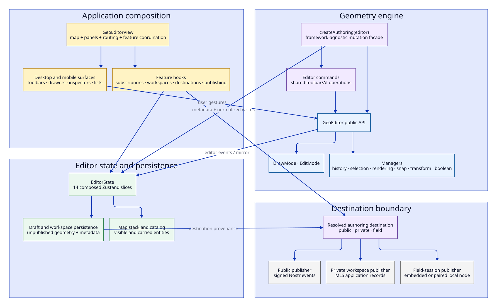
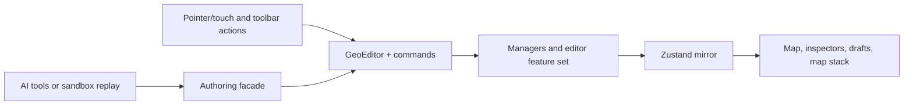
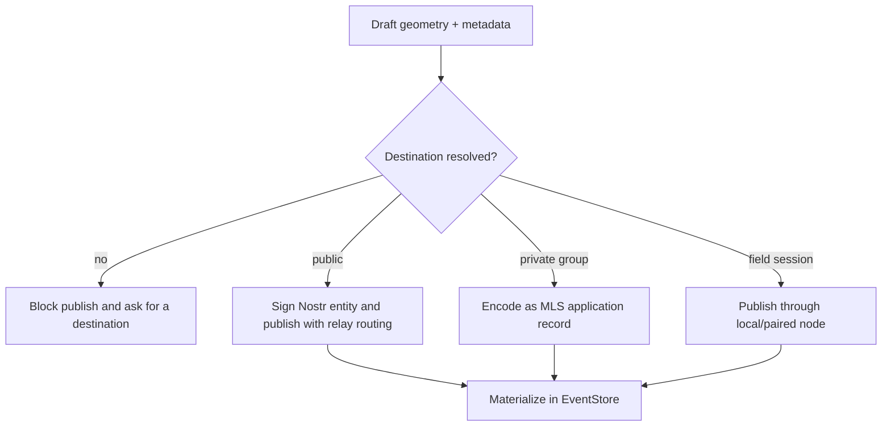

# Editor and publishing architecture

The editor cluster turns user gestures, imported data, and AI tool calls into the same normalized geometry model. It then publishes that model to one explicitly resolved destination: public Nostr, an MLS private group, or a nearby field session.

This page describes the current implementation. Refactoring candidates are labeled separately.

## Structural view

## Responsibilities

| Module | Owns | Does not own |
| --- | --- | --- |
| [`GeoEditorView`](../../src/features/geo-editor/GeoEditorView.tsx) | Top-level feature composition, route-driven panels, editor lifecycle, subscriptions, workspace and destination coordination | Geometry algorithms, relay connections, MLS cryptography, native transport implementation |
| [`GeoEditor`](../../src/features/geo-editor/core/GeoEditor.ts) | The public interactive editor API and manager lifecycle | React, Nostr signing, persistence, application routing |
| [`core/managers`](../../src/features/geo-editor/core/managers) | Selection, rendering, history, snapping, transforms, boolean/combine/simplify operations | Application destinations or UI panels |
| [`store`](../../src/features/geo-editor/store) | Reactive editor state composed from 14 slices | MapLibre's internal state or relay-owned event history |
| [`commands.ts`](../../src/features/geo-editor/commands.ts) | Shared named operations used by toolbars and AI callers | Arbitrary geometry writes or signing |
| [`api/authoring.ts`](../../src/features/geo-editor/api/authoring.ts) | Normalized geometry mutation and dataset metadata facade | Signers, wallets, chat state, relay publishing |
| [`usePublishing`](../../src/features/geo-editor/hooks/usePublishing.ts) | Publish gates, signing, route completion, and destination-specific dispatch | MLS state transitions or local-node protocol details |
| Dataset/workspace hooks | Draft persistence, reopening, map-stack association, and dataset lifecycle | The low-level editor algorithms |

## State topology

`EditorState` is one Zustand store composed from these slices:

- editor core;
- draft;
- workspace;
- metadata;
- publishing;
- view mode;
- map stack;
- UI/mobile surfaces;
- search;
- map source;
- session synchronization;
- stance;
- catalog;
- geo query.

The single store is intentional at the consumption boundary: components can select a coherent view without coordinating several providers. The slices are implementation modules, not independent stores. A future split should be justified by lifecycle or ownership differences, not file size alone.

## Geometry mutation paths

There are two user-visible entry classes but one editor model:

`Authoring` is the security and locality boundary for non-UI geometry changes. It normalizes GeoJSON, preserves deduplication behavior, runs interceptors, and exposes dataset metadata without exposing the rest of the application.

## Destination and publish flow

The same geometry can have three destinations, but it must never be ambiguous at publish time.

Draft persistence carries destination provenance. If an old or quarantined draft cannot prove its private/field destination, `usePublishing` does not allow it to fall through to the public publisher.

## Invariants

1. Geometry in the editor uses normalized editor features, regardless of whether it came from drawing, import, AI, Nostr, MLS, or a field session.
2. The editor engine is unaware of Nostr, MLS, Tauri, and React.
3. AI callers mutate through `Authoring`; direct store/editor access is not part of the AI tool contract.
4. Public attachment validation is advisory unless a separate product rule explicitly makes it blocking.
5. Destination resolution happens before signing or external storage upload.
6. Private and field writes never silently use the public `publish()` path.
7. Reopened drafts preserve their publication boundary or remain quarantined.
8. The map stack is a view of available entities, not the canonical owner of their event history.

## Stable seams and test surfaces

- `GeoEditor` public methods and manager tests cover geometry behavior.
- `commands.ts` is the named-operation surface shared by UI and AI.
- `Authoring` has boundary, interceptor, primitive, diff, validation, golden, and mutation tests.
- Zustand slices have focused tests for draft, map-stack, editor-core, and mobile-surface behavior.
- Publishing hooks and entity factories protect event shape and routing behavior.
- Browser AI scenarios exercise creation and editing workflows through visible UI.

## Pressure points

### `GeoEditorView` is a broad composition root

It imports and coordinates almost every feature cluster. That makes cross-feature changes easy to start but difficult to localize and difficult to test without the whole application.

Candidate direction: keep `GeoEditorView` as the explicit application composition root, but move lifecycle-heavy coordination into deep feature runtimes or hooks that expose a small state/command surface. Avoid components that merely forward the same dozen props.

### Destination is a concept, not just three optional IDs

Private workspace ID, field-session ID, public context focus, draft provenance, current pills, and publisher callbacks jointly answer “where will this go?”

Candidate direction: model a resolved `AuthoringDestination` value that owns identity, kind, label, availability, provenance, and publish capability. This should replace distributed conditionals rather than sit above them as a second model.

### Editor/store mirroring is an implicit contract

Some operations originate in `GeoEditor`, while panels and publishing consume Zustand state. Event emission and store synchronization therefore form a critical contract that is easy to bypass with a new mutation method.

Candidate direction: make the mirror boundary explicit in tests and documentation before changing ownership. Do not create two canonical geometry stores.

### The store has mixed lifecycles

UI stances, persisted drafts, search state, catalog state, and live editor state coexist. This is not automatically wrong, but changes can invalidate more selectors and persistence logic than expected.

Candidate direction: classify slices by lifecycle—ephemeral UI, editor session, durable draft, remote materialization—then split only where initialization, reset, or persistence genuinely differs.

## Safe refactoring checklist

Before changing this cluster, preserve tests for:

- draw/edit/cancel and pan-lock behavior on mobile;
- undo/history and normalized feature IDs;
- draft reopen without data loss;
- public/private/field destination isolation;
- map-stack add/remove stability;
- AI authoring boundary and pending-diff safety;
- publish/update/copy/proposal event lineage;
- route and inspector state after a successful publish.
