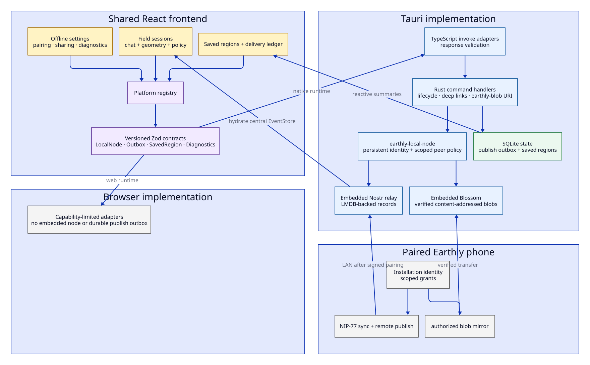
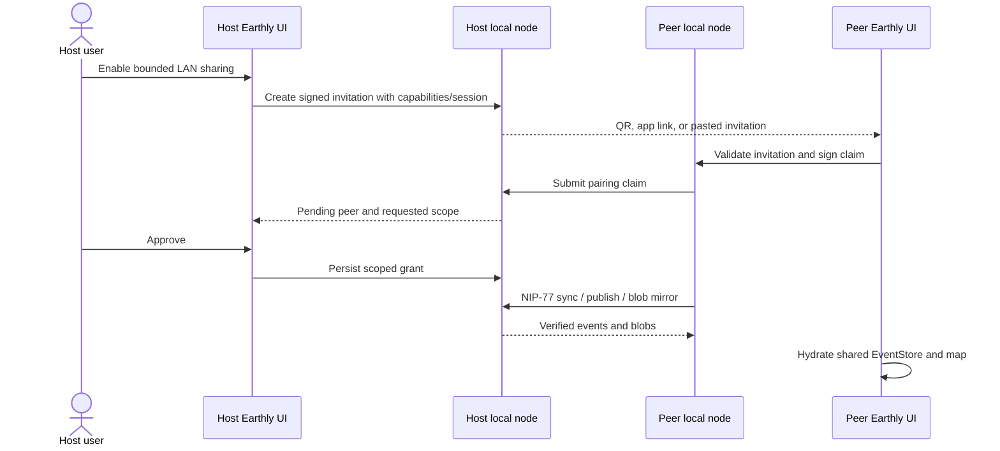

# Native application and offline architecture

The Android app embeds the web frontend but does not treat Tauri as a thin packaging shell. The native runtime owns a reusable local Nostr/Blossom node, device pairing and policy, durable delivery, saved map regions, deep links, and bounded local blob access.

## Structural view

## Platform boundary

Feature code asks the [`platform registry`](../../src/platform/registry.ts) for capabilities defined in [`platform/contracts.ts`](../../src/platform/contracts.ts):

- `LocalNodeService`;
- `PublishOutboxService`;
- `SavedRegionService`;
- `SupportDiagnosticsService`.

The registry loads Tauri implementations dynamically when native. Browser implementations either provide a bounded fallback or explicitly report that the capability is unavailable. This keeps Tauri imports out of normal feature modules and prevents browser builds from bundling native-only code.

TypeScript adapters validate every command response with Zod. Rust command functions use versioned names, making the IPC surface an interface that can be tested without exposing raw application state.

## Native ownership

| Layer | Ownership |
| --- | --- |
| [`src/platform/tauri`](../../src/platform/tauri) | Typed frontend adapters, response validation, and UI-facing events |
| [`src-tauri/src/lib.rs`](../../src-tauri/src/lib.rs) | Plugin setup, application data locations, service state, custom URI registration, and command registration |
| [`src-tauri/src/local_node.rs`](../../src-tauri/src/local_node.rs) | Tauri command facade over the reusable local node |
| [`crates/earthly-local-node`](../../crates/earthly-local-node) | Transport-neutral identity, pairing, peer policy, relay, Blossom, remote sync/publish, and blob mirroring |
| [`src-tauri/src/outbox.rs`](../../src-tauri/src/outbox.rs) | Durable signed-event delivery queue and relay result ledger |
| [`src-tauri/src/saved_regions.rs`](../../src-tauri/src/saved_regions.rs) | Region plans, downloads, verification, hydration, deletion retention, repair, and garbage collection |

`earthly-local-node` deliberately has no Tauri dependency. Reference applications and Rust tests can prove the handshake and protocol behavior independently from Android UI automation.

## Pairing and field-session flow

The invitation is not authority by itself. The host must approve the installation identity and requested capabilities. Grants can be scoped to a field session and revoked.

## Offline capabilities

### Embedded relay and Blossom

Every native installation has a persistent identity and loopback relay/Blossom services. A user can temporarily expose them on a selected private network interface. Android keeps an explicitly enabled sharing session alive through a visible, bounded foreground service.

### Field sessions

A field session is a collaboration destination and cognitive boundary, not merely “offline mode.” Hosts and approved participants exchange session-scoped Nostr records through the local node. Both host and child devices can publish when policy allows; received records are verified and hydrated into the same client EventStore used by online records.

### Publish outbox

On native, signed non-beacon events enter SQLite before the first network attempt. Start, resume, connectivity recovery, and explicit retry can replay the byte-identical event. The web build intentionally has no equivalent durable queue.

### Saved regions and local blobs

Saved-region plans select relevant Nostr records and content-addressed map/blob resources. Native download paths verify size and hash before adoption. The read-only `earthly-blob` URI exposes exact local hashes with bounded GET, HEAD, and single-range responses so the shared frontend can prefer local content.

## Invariants

1. Feature code does not call `invoke` directly; it uses platform services.
2. Tauri adapter results are runtime-validated before entering React state.
3. Pairing invitations are signed, expiring, one-use handoffs; access still requires explicit host approval.
4. Peer grants are capability-scoped and can be field-session-scoped.
5. Remote events are signature-verified before local persistence or EventStore hydration.
6. Mirrored blobs are hash-verified and adopted atomically.
7. The WebView is not granted unrestricted cleartext LAN access; peer operations use native transport.
8. The native outbox stores already signed bytes and cannot silently re-sign an event during replay.
9. Browser capability limitations remain visible to the user instead of emulating durability that does not exist.

## Test surface

- Rust workspace unit and network integration tests for relay, Blossom, pairing, policy, remote sync/publish, range reads, and persistence.
- TypeScript contract and platform-adapter tests.
- Saved-region planning, hydration, storage-guidance, and deletion tests.
- Field-session transport and map-stack reconciliation tests.
- Android UI Automator smoke tests for app links, lifecycle, and Android-only integration.
- Browser tests for capability-limited fallback surfaces.

## Pressure points

### The platform contract file groups unrelated capabilities

The registry boundary is real, but local node, outbox, saved regions, and diagnostics have different lifecycles.

Candidate direction: split the declarations into capability modules re-exported by one public contract surface. Do not add another interface between the registry and the existing adapters.

### Field synchronization is coordinated by a React hook

Foreground polling, host/participant branching, signature checks, transport calls, and EventStore hydration currently live together in `useFieldSessionTransport`.

Candidate direction: introduce one session-scoped runtime only if it replaces the polling/orchestration path and can be exercised without React. Its public surface should resemble state snapshots plus commands, not expose the local-node service wholesale.

### Saved-region implementation is deep but very large

The Rust module owns planning execution, progress, validation, repair, retention, and garbage collection. Those behaviors share transactions and invariants, so file size alone is not a reason to split it.

Candidate direction: identify sub-domains by independent invariants and test fixtures—such as verified blob acquisition or deletion retention—then extract only when it improves locality without scattering transactions.

### Online and field records share materialization but not delivery

Hydrating both into one EventStore is useful, but origin/session provenance must survive deduplication and map-stack reconciliation.

Candidate direction: define provenance as explicit materialization metadata rather than infer it repeatedly from the active route or current session.

## Release scope

The supported distribution target is Android plus the web deployment. See [Tauri development](../TAURI-DEVELOPMENT.md), [Android release](../ANDROID-RELEASE.md), and [Android update/release](../ANDROID-UPDATE-RELEASE.md) for operational procedures.
