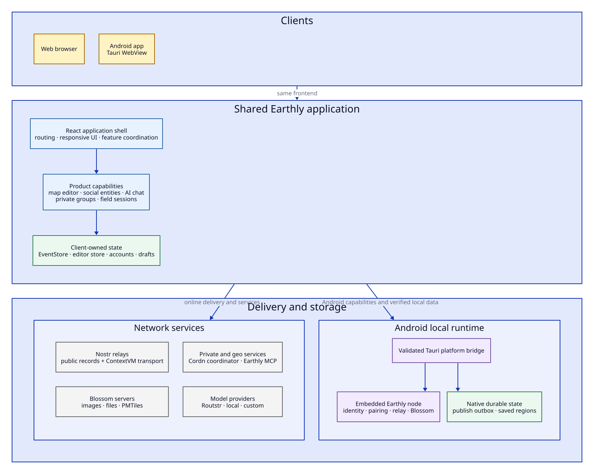

# Earthly architecture

This is the canonical, as-implemented architecture overview for Earthly. It is meant to help a new contributor find the code, and to make future refactoring safer by recording ownership, invariants, and the seams that already exist.

Last verified against the codebase: 2026-07-18.

## How to read these documents

The diagrams describe the current system, not a proposed target architecture. Refactoring ideas are kept in separate **Pressure points** sections so an attractive future design cannot accidentally become documentation for code that does not exist.

The visual language is consistent across all structural diagrams:

| Color | Meaning |
| --- | --- |
| Yellow | User-facing UI or application composition |
| Blue | Runtime logic owned by Earthly |
| Green | Durable or materialized state owned by Earthly |
| Purple | An intentional interface or adapter seam |
| Gray | A separately deployed or externally owned dependency |
| Red | A security or mutation-safety boundary |

The D2 source is committed beside each generated SVG. D2 is used for structural views because nested containers communicate ownership better than a flat flowchart. Mermaid remains useful inside these pages for sequences and state transitions.

## System context



Earthly has one React application and two materially different runtimes:

- The web application runs entirely in the browser and talks to public or configured network services.
- The Android application embeds the same frontend in Tauri and adds Rust-owned local services, durable delivery state, saved regions, deep links, and device-to-device field transport.

The current release target is web plus Android. Desktop Tauri builds are useful during development, but macOS, Windows, Linux, and iOS distribution are not current product targets.

## Runtime inventory

| Runtime/module | Responsibility | Primary entry point |
| --- | --- | --- |
| Bun web server | Serves the SPA and worker assets, NIP-05, crawler routes, and generated Open Graph responses | [`src/index.ts`](../../src/index.ts) |
| React application | Installs account and event-store providers, starts native bridges, and renders the editor shell | [`src/frontend.tsx`](../../src/frontend.tsx) |
| Application composition | Coordinates the map, panels, routing, entity subscriptions, workspaces, private groups, field sessions, and chat | [`src/features/geo-editor/GeoEditorView.tsx`](../../src/features/geo-editor/GeoEditorView.tsx) |
| Nostr runtime | Owns the single EventStore, RelayPool, account manager, cache, loaders, relay routing, and publish path | [`src/lib/nostr/index.ts`](../../src/lib/nostr/index.ts) |
| Geo editor | Owns interactive geometry operations and the editor/store mirror | [`src/features/geo-editor/core/GeoEditor.ts`](../../src/features/geo-editor/core/GeoEditor.ts) |
| AI chat | Owns model requests, conversation persistence, the tool loop, safety gates, workers, and provider adapters | [`src/features/chat/`](../../src/features/chat) |
| Private collaboration | Owns MLS state, invitations, membership, encrypted application records, coordinator sync, and local projection | [`src/lib/private-workspace/`](../../src/lib/private-workspace) |
| Platform boundary | Selects browser or Tauri capability implementations behind validated contracts | [`src/platform/registry.ts`](../../src/platform/registry.ts) |
| Tauri shell | Owns OS lifecycle, command registration, deep links, SQLite services, and the local-blob URI | [`src-tauri/src/lib.rs`](../../src-tauri/src/lib.rs) |
| Local node | Reusable Rust module for identity, policy, pairing, embedded relay/Blossom, peer sync, and blob transfer | [`crates/earthly-local-node/`](../../crates/earthly-local-node) |
| Geo relay | Stores Nostr events in LMDB and maintains a derived Bleve geo/search index | [`relay/`](../../relay) |
| ContextVM geo server | Provides geocoding and web-aware MCP tools over Nostr | [`contextvm/`](../../contextvm) |

## Data ownership

| Data | Owner | Durability |
| --- | --- | --- |
| Public Nostr records | Relays; materialized in the client EventStore | Relay storage plus browser IndexedDB cache |
| Accounts and active signer selection | Applesauce `AccountManager` | Browser storage when the account is not ephemeral |
| Unpublished geometry and workspace metadata | Editor Zustand store and draft persistence | Browser storage |
| Current map/editor materialization | `GeoEditor`, editor store, and MapLibre | In memory; rebuilt from drafts/events |
| MLS group state, records, journals, and cursors | Private workspace storage | Browser storage, account-scoped |
| Native publish queue | Tauri outbox service | SQLite; absent in the browser runtime |
| Saved offline regions | Tauri saved-region service and local node blobs | SQLite metadata plus verified local files |
| Paired-node identity, grants, relay events, and blobs | `earthly-local-node` | Native app data directories |
| Relay geo index | Go relay | Derived from canonical LMDB events and rebuildable |

## Dependency ownership

The distinction matters during refactoring: not every network-shaped dependency deserves the same abstraction.

| Category | Dependencies | Consequence |
| --- | --- | --- |
| In-process | Geo editor, Zustand stores, tool registry, private workspace runtime | Refactor with unit tests and explicit ownership; avoid adapter layers without a second implementation |
| Locally substitutable | Browser/Tauri platform services, model-provider configuration, ContextVM clients | Existing interfaces are real seams because multiple implementations or deployments exist |
| Remote, Earthly-operated | Public relay, Blossom, geo ContextVM server, Cordn coordinator | Keep protocol contracts and deployment ownership visible; local mocks must preserve wire behavior |
| True external | User-selected relays, Blossom hosts, Nostr signers, model providers, geocoding/search APIs | Treat failures, latency, partial availability, and user choice as normal states |

## Cross-cutting invariants

These are the contracts a refactor must preserve:

1. Only [`src/lib/nostr/index.ts`](../../src/lib/nostr/index.ts) constructs the application-wide relay pool and account manager; the EventStore is constructed by its dedicated store module and re-exported from the same public runtime surface.
2. Public, MLS-private, and field-session publishing are distinct destinations. A draft with unresolved destination provenance must never fall back to public publishing.
3. Geometry mutation used by AI and non-UI callers goes through the `Authoring` facade; it does not expose signers, wallets, or arbitrary application state.
4. Native command responses are validated at the TypeScript boundary before feature code consumes them.
5. The browser intentionally lacks an embedded local node and durable publish outbox. Capability absence is a supported implementation, not an exception to hide.
6. MLS mutations are ordered. `PrivateWorkspaceRuntime` serializes coordinator operations before publishing React snapshots.
7. Saved blobs are content-addressed and verified before local adoption. Local URI access is read-only and bounded.
8. Local development may read broadly when configured, but write routing remains isolated from public relays on a loopback origin.
9. Legacy or malformed new-model events do not enter current render sets merely because their kind number matches.

## Existing seams worth preserving

- [`createAuthoring(editor)`](../../src/features/geo-editor/api/authoring.ts) is a deep, narrow mutation interface shared by editor tools and the AI sandbox replay path.
- The [chat tool registry](../../src/features/chat/tools/registry.ts) co-locates schemas, handlers, and tool kinds and gives the tool loop one dispatch surface.
- The [platform contracts](../../src/platform/contracts.ts) and [registry](../../src/platform/registry.ts) are a real browser/native adapter boundary.
- The [relay router](../../src/lib/nostr/relay-router.ts) centralizes read/write stage isolation.
- `earthly-local-node` does not depend on Tauri, which keeps the offline protocol independently testable.
- The private workspace runtime is the account-scoped serialization and snapshot boundary for React consumers.

## Pressure points and refactoring opportunities

These are evidence-backed candidates, not approved designs.

| Pressure point | Evidence | Refactoring question |
| --- | --- | --- |
| Application composition is overloaded | `GeoEditorView.tsx` coordinates UI layout, routing, subscriptions, editor lifecycle, map-stack reconciliation, private groups, field sessions, saved regions, and chat | Can feature coordinators be extracted behind existing hooks/runtimes while keeping one explicit top-level composition root? |
| Authoring destination is distributed | Workspace/draft state, route focus, destination pills, and publishing hooks all participate in deciding where a write lands | Can one domain value own destination identity, provenance, availability, display label, and publisher resolution? |
| Chat runtime and UI are large | `ChatPanel.tsx` and `chat/store.ts` each combine several lifecycle concerns | Can the provider/tool conversation engine become a deep module while the store remains persistence/reactivity and the panel remains presentation? |
| Private workspace service has many reasons to change | Membership, recovery journals, MLS application messages, coordinator sync, and projections converge in one service | Which cohesive sub-domains have their own invariants and tests, rather than merely their own filenames? |
| Platform contracts are broad | One file defines local node, outbox, saved-region, and diagnostics capabilities | Can contracts be grouped by capability without introducing pass-through interfaces or weakening the registry boundary? |
| Group/context language is transitional | The current kind-37518 model is a slim Group, while many consumer names and routes still say map context | What is the migration boundary for domain language, and which public URLs/storage keys must remain compatible? |
| Field transport lives in a React polling hook | The hook performs foreground polling, sync, signature checks, EventStore hydration, and host/participant branching | Would an account/session-scoped runtime improve locality and testability in the same way the private workspace runtime did? |

## Refactoring protocol

Use this sequence when one of the opportunities becomes active work:

1. Write down the observed change pressure and the current owner.
2. Select the invariants and user journeys that must remain true.
3. Identify an existing seam. Introduce a new interface only for a real boundary or when at least two implementations are present.
4. Prefer one deep replacement module over a new layer of forwarding wrappers.
5. Move behavior and its tests together, then remove the old path in the same change when practical.
6. Update the as-is diagram only after the code changes. Put proposed architecture in a separate design document or clearly labeled target diagram.

## Architecture map

- [Editor and publishing](./editor.md)
- [AI chat and tool execution](./chat.md)
- [Native application and offline system](./native-and-offline.md)
- [MLS private collaboration](./private-collaboration.md)
- [Nostr entity model](../../SPEC.md)
- [Relay search architecture](../../relay/README.md)
- [Android/Tauri development](../TAURI-DEVELOPMENT.md)

## Rendering the diagrams

Run:

```sh
bun run docs:diagrams
```

When D2 is absent, the script downloads the pinned [D2 v0.7.1 release](https://github.com/terrastruct/d2/releases/tag/v0.7.1), verifies the platform-specific SHA-256 checksum, and caches the executable under `.cache/tools`. Set `D2_BIN=/path/to/d2` to use an existing pinned binary, or `EARTHLY_TOOLS_CACHE=/path` to change the cache root. Generated SVGs are committed so GitHub and offline readers do not need D2 installed.
