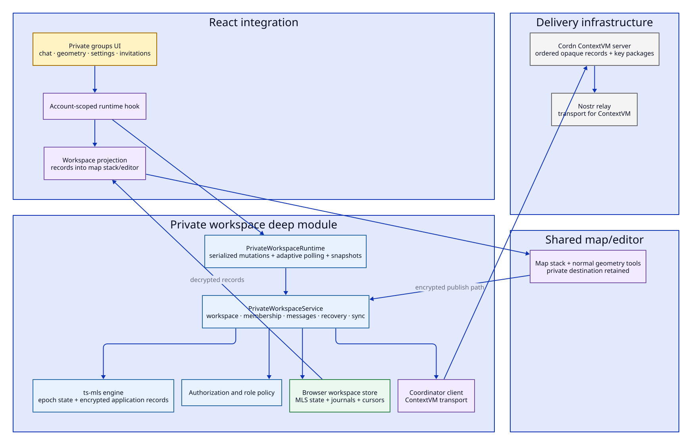
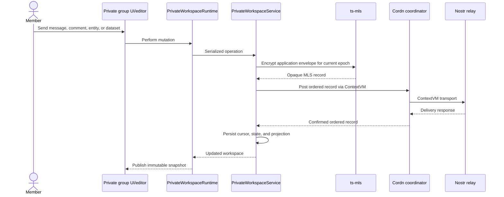

# MLS private collaboration architecture

Private groups let members collaborate on chat, comments, entities, and map geometry while Nostr remains the delivery layer. Application records are encrypted with MLS before the Cordn coordinator stores and orders them.

Private groups are an online encrypted collaboration feature. They are not the offline field-session transport, although both project records into the same map/editor and both are authoring destinations.

## Structural view

## Component responsibilities

| Module | Responsibility |
| --- | --- |
| [`usePrivateWorkspaceRuntime`](../../src/features/private-maps/usePrivateWorkspaceRuntime.ts) | Keeps one account-scoped runtime and storage instance available to React |
| [`PrivateWorkspaceRuntime`](../../src/lib/private-workspace/runtime.ts) | Serializes operations, maintains immutable snapshots, shares polling across consumers, and backs off when offline |
| [`PrivateWorkspaceService`](../../src/lib/private-workspace/service.ts) | Workspace creation, invitations, join approval, membership changes, application messages, recovery journals, and coordinator sync |
| [`mls.ts`](../../src/lib/private-workspace/mls.ts) | ts-mls state creation, Welcome handling, commits, epoch transitions, encryption, and decryption |
| [`policy.ts`](../../src/lib/private-workspace/policy.ts) | Authorization rules for administrators, members, and application envelopes |
| [`storage.ts`](../../src/lib/private-workspace/storage.ts) | Browser persistence for group state, messages, cursors, pending joins, and recovery data |
| [`coordinator.ts`](../../src/lib/private-workspace/coordinator.ts) | ContextVM client for the Cordn-compatible server |
| [`projection.ts`](../../src/lib/private-workspace/projection.ts) | Converts decrypted workspace records into UI/map entities |

## Record flow

Incoming records follow the reverse path: ordered coordinator records are fetched, decrypted for the correct epoch, authorized, stored, projected, and only then exposed to React and the map stack.

## Membership lifecycle

1. An administrator creates a workspace and publishes or shares a signed invitation link/QR.
2. A prospective member validates the invitation and posts a key package/join request through the coordinator.
3. An administrator approves the request, creating the MLS membership transition and Welcome material.
4. The new member accepts the Welcome and begins at the resulting epoch.
5. Administrators can promote, demote, or remove members; removal protects future epochs.

MLS does not erase information a former member already decrypted. The product also does not promise that a new member can reconstruct all earlier chat and geometry history. Current state may be explicitly re-shared, but full historical disclosure must remain an intentional product policy rather than an accidental property of storage.

## What is encrypted

Earthly encrypts private workspace application envelopes, including chat, comments, entity metadata, and datasets/geometry. The coordinator stores opaque records and the browser stores the MLS state required to decrypt authorized epochs.

As with most relay-delivered encrypted systems, encryption does not hide every form of metadata. Relay/coordinator participation, record timing, sizes, and delivery relationships may remain observable. Browser state is protected by the browser/device storage model, not hardware-backed key isolation.

## Projection into the shared app

Decrypted private records use feature-specific projection rather than a separate private map renderer:

- private datasets become map-stack entries;
- geometry opens in the normal inspector/editor;
- private comments can carry optional geometry attachments;
- authoring destination remains the private workspace when editing or replying;
- public Nostr publishing remains unavailable until the user explicitly leaves or changes destination.

This reuse is important: private collaboration owns delivery and authorization, while the geo editor owns geometry interaction.

## Invariants

1. MLS state transitions for an account are serialized.
2. The coordinator never receives plaintext private application content.
3. An envelope is authorized for the workspace, sender role, message type, and group state before projection.
4. A coordinator post is not considered confirmed merely because the request returned without the expected record.
5. Local journals make interrupted membership/application operations recoverable and idempotent.
6. React consumers share one runtime/poll schedule per account and workspace.
7. Decrypted private datasets may enter the shared map stack, but their destination provenance remains private.
8. Removing a member changes future access; it cannot revoke plaintext already seen.

## Test surface

- MLS creation, add/remove, epoch, encryption, and decryption tests.
- Invitation, policy, envelope authorization, checkpoint, and last-resort key-package tests.
- Coordinator client and delayed/established delivery smoke tests.
- Service tests for creation, joining, membership changes, application records, retries, and recovery.
- Runtime tests for serialization, snapshots, shared polling, backoff, and disposal.
- Projection and private map-stack tests.
- Browser UI scenarios for invitations, messaging, geometry, and member administration.

## Pressure points

### `PrivateWorkspaceService` spans several sub-domains

It owns membership transactions, application messages, coordinator sessions, recovery journals, and projection-triggering persistence. These operations are related by ordered MLS state, so naive file splitting could make the invariants harder to see.

Candidate direction: first name the transactional units—membership change, application append, coordinator reconciliation—and document their journals. Extract a deep module only when it owns one complete transaction and its recovery tests.

### Storage and cryptographic state are browser-bound

The account-scoped browser store is practical, but private workspace recovery and multi-device behavior depend on the durability and portability of MLS state.

Candidate direction: define backup/device-transfer product policy before abstracting storage. A second storage implementation would make a storage interface real; until then, prefer one cohesive store with explicit schemas and migrations.

### Polling and UI freshness are coupled to workspace visibility

The runtime adaptively polls selected workspaces and backs off on failure. This is simple and observable, but a future subscription-capable coordinator could change the transport model.

Candidate direction: keep the runtime snapshot/command surface stable and replace its internal synchronization strategy only when a second delivery mechanism exists.

### Private and field destinations look similar in UI but differ in trust

Both are collaboration workspaces with chat and geometry. Private groups use MLS over network relays; field sessions use explicitly paired nearby nodes and capability policy.

Candidate direction: share the user-facing destination vocabulary and map/editor integration, not the underlying transport or security model. A generic “collaboration transport” interface would currently hide important differences.

## Operational dependency

Production requires a configured Cordn server public key and the corresponding Cordn service reachable over its announced Nostr relays. See [private maps deployment](../PRIVATE-MAPS-DEPLOYMENT.md) for deployment details.
